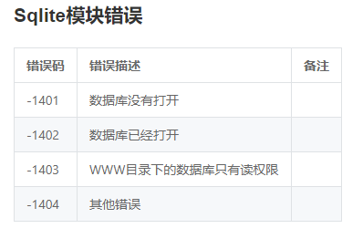

# uni-app

uni-app使用vue的语法+小程序的标签和API

## 创建项目

### 通过HBuilderX可视化界面

HBuilderX内置相关环境，开箱即用，无需配置nodejs。

uni-app自带的模板有 Hello uni-app ，是 **官方的组件和API示例**。

还有一个重要模板是 uni ui项目模板，**日常开发推荐使用该模板**，已内置大量常用组件。

运行到浏览器—>在浏览器里面体验uni-app 的 **H5** 版

运行的快捷键是`Ctrl+r`。

uni-app默认把项目编译到根目录的**unpackage**目录。

### 通过vue-cli命令行(不推荐)

```
npm install -g @vue/cli
```

**使用正式版**（对应HBuilderX最新正式版）

```
vue create -p dcloudio/uni-preset-vue my-project
```

**使用alpha版**（对应HBuilderX最新alpha版）

```
vue create -p dcloudio/uni-preset-vue#alpha my-alpha-project
```

此时，会提示选择项目模板，初次体验建议选择 `hello uni-app` 项目模板

选择自定义模板时，需要填写 uni-app 模板地址，这个地址其实就是托管在云端的仓库地址。

```
npm run dev:%PLATFORM%
npm run build:%PLATFORM%
```

`%PLATFORM%` 可取值，mp-weixin、h5、app-plus等

app平台生成打包资源（仅支持npm run build:app-plus，也就是**App平台运行调试不支持cli方式**，需在HBuilderX中运行调试）

### 两种方式的区别

#### 编译器的区别

`cli`创建的项目，编译器安装在项目下。并且**不会跟随HBuilderX升级**。如需升级编译器，执行`npm update`。

HBuilderX创建的项目，编译器在HBuilderX的安装目录下的plugin目录，**随着HBuilderX的升级会自动升级**编译器。

将`cli`创建的项目，拖到HBuilderX中。如果是把**整个项目**拖入HBuilderX，则编译时走的是项目下的编译器。如果是把**src目录**拖入到HBuilderX中，则走的是HBuilderX安装目录下plugin目录下的编译器。

#### 开发工具的区别

`cli`创建的项目，**内置**了d.ts

HBuilderX创建的项目不带d.ts，HBuilderX**内置了uni-app语法提示库**。

如需把HBuilderX创建的项目在其他编辑器打开并且补充d.ts，可以在项目下先执行 `npm init`，然后`npm i @types/uni-app -D`，来**补充d.ts**。

vscode等其他开发工具，在vue或uni-app领域，开发效率**比不过**HBuilderX。

发布App时，仍然需要使用HBuilderX。**其他开发工具无法发布App**，但可以发布H5、各种小程序。

### 总结

推荐使用HBuilder

HBuilderX创建的项目，一样可以使用npm

## uni-app由来

既然各巨头无法在标准上达成一致，那么就通过这个框架为开发者抹平各平台差异。

### 当前跨平台开发存在的问题

多端泛滥，Android、IOS、H5多种平台，小程序、快应用多种规范

过去的跨平台框架体验不好，生态不丰富

## uni-app特征

### 跨平台

一套代码，多端发行

条件编译：在一个项目里调用不同平台的**特色功能**

```
<template>
    <view class="content">
      <!-- #ifdef MP-WEIXIN -->
      <view class="">
          只会编译到小程序
      </view>
      <!-- #endif -->
      
      <!-- #ifdef APP-PLUS -->
      <view class="">
          只会编译到App
      </view>
      <!-- #endif -->
    </view>
</template>
```

### 运行体验更好

**组件、api与微信小程序一致**，兼容weex原生渲染(nvue)（ **局部使用** weex来提升体验）

### 通用技术栈

vue的语法、微信小程序的api、**内嵌mpvue**

### 开放生态，组件更丰富

* 支持通过**npm**安装第三方包
* 支持微信小程序自定义组件及SDK，**支持将微信小程序的SDK和自定义组件在App里面进行使用**
* **兼容mpvue**组件及项目
* App端支持和原生**混合**编码，支持native.js直接调用原生API，支持第三方原生SDK
* 插件市场，支持业内主流的SDK服务商提供的SDK

## 项目目录结构

### components

> **可复用** 的组件

### pages

> 业务页面

### static

> 静态资源目录，所有的静态文件都应该放置在static目录下

### App.vue

> 配置全局的事件生命周期
>
> 全局的样式(每个页面的公共css)

### main.js

> 作为Vue的入口文件

### manifest.json

> app项目的配置中心
>
> 应用的配置文件，用于指定应用的名称、图标、权限等。

### pages.json

> 全局配置，决定页面文件的路径、窗口样式、原生的导航栏、底部的原生tabbar 等
>
> pages数组中第一项表示应用启动页

### uni.scss

> uni-app内置的常用样式变量

## 三层学习方式

> 模板层(template)、脚本层(script)、样式层(style)

### 模板层

学习uni-app基础组件，同微信小程序基础组件保持一致。

#### `<template/>` 和 `<block/>`

`uni-app` 支持在 template 模板中嵌套 `<template/>` 和 `<block/>`，用来进行 [列表渲染](https://uniapp.dcloud.io/use?id=列表渲染) 和 [条件渲染](https://uniapp.dcloud.io/use?id=条件渲染)。

`<template/>` 和 `<block/>` 并不是一个组件，它们仅仅是一个包装元素，不会在页面中做任何渲染，只接受控制属性。

`<block/>` 在不同的平台表现存在一定差异，推荐统一使用 `<template/>`。

### 脚本层

以Vue.js为基础，注意学习一下不支持的部分。Vue.js某些复杂的部分不会在uni-app中使用。

uni-app接口，与微信小程序保持一致。

### 样式层

CSS3标准规范，推荐使用**flex布局**。为支持跨平台，框架建议使用Flex布局。

#### 尺寸和单位

* `uni-app` 支持的**通用 css 单位**包括 px、rpx。
  * px是绝对单位，对应像素。
  * rpx即响应式px，自适应的动态单位，规定屏幕基准宽度750upx。推荐使用rpx，**upx不再推荐使用**
  * px、rpx转换：`设计稿1px / 设计稿基准宽度 = 框架样式1rpx / 750rpx`
* nvue里**不支持**普通H5单位(rem,vh,vw)和百分比单位，vue页面**支持**
  * rem 默认根字体大小为 屏幕宽度/20
  * vh viewpoint height，视窗高度，1vh等于视窗高度的1%
  * vw viewpoint width，视窗宽度，1vw等于视窗宽度的1%
* nvue中，uni-app模式可以使用px、rpx，与vue中一致
* App端，在 pages.json 里的 titleNView 或页面里写的 plus api 中涉及的单位，只支持 px。**注意此时不支持 rpx**
* 注意 rpx 是和宽度相关的单位，**屏幕越宽，该值实际像素越大**。如不想根据屏幕宽度缩放，则应该使用 px 单位。
* rpx不支持动态横竖屏切换计算，使用rpx建议 **锁定屏幕方向**
* 早期 uni-app 提供了 upx ，目前已经**推荐统一改为 rpx** 了，动态绑定style**不支持**直接使用upx，rpx支持动态绑定

#### 样式

##### 静态样式与动态样式

> 静态的样式统一写到 class 中。style 接收动态的样式，在运行时会进行解析，请尽量避免将静态的样式写进 style 中，**以免影响渲染速度**。

##### 全局样式与局部样式

* 全局样式，定义在 App.vue 中的样式，作用于每一个页面。
* 局部样式，在 pages 目录下 的 vue 文件中定义的样式为局部样式，只作用在对应的页面，并会覆盖 App.vue 中相同的选择器。
* App.vue 中通过 `@import` 语句可以导入外联样式，一样作用于每一个页面。
* nvue页面暂**不支持**全局样式

#### 选择器

* 支持id选择器、类选择器、元素选择器、伪元素选择器

* 在 `uni-app` 中不能使用 `*` 选择器。

* `page` 相当于 `body` 节点

  ```css
  <!-- 设置页面背景颜色 -->
  page {
    background-color:#ccc;
  }
  ```

* 微信小程序自定义组件中仅支持 class 选择器

#### [内置CSS变量]([https://uniapp.dcloud.io/frame?id=css%e5%8f%98%e9%87%8f](https://uniapp.dcloud.io/frame?id=css变量))

| CSS变量             | 描述                   | App                                                          | 小程序 | H5                   |
| :------------------ | :--------------------- | :----------------------------------------------------------- | :----- | :------------------- |
| --status-bar-height | 系统状态栏高度         | [系统状态栏高度](http://www.html5plus.org/doc/zh_cn/navigator.html#plus.navigator.getStatusbarHeight)、nvue注意见下 | 25px   | 0                    |
| --window-top        | 内容区域距离顶部的距离 | 0                                                            | 0      | NavigationBar 的高度 |
| --window-bottom     | 内容区域距离底部的距离 | 0                                                            | 0      | TabBar 的高度        |

* 当设置 `"navigationStyle":"custom"` 取消原生导航栏后，由于窗体为沉浸式，占据了状态栏位置。此时可以使用一个高度为 `var(--status-bar-height)` 的 view 放在页面顶部，避免页面内容出现在状态栏。

#### 固定值

`uni-app` 中以下组件的高度是固定的，不可修改：

| 组件          | 描述       | App                                                          | H5   |
| :------------ | :--------- | :----------------------------------------------------------- | :--- |
| NavigationBar | 导航栏     | 44px                                                         | 44px |
| TabBar        | 底部选项卡 | HBuilderX 2.3.4之前为56px，2.3.4起和H5调为一致，统一为 50px。但可以自主更改高度） | 50px |

各小程序平台，包括同小程序平台的iOS和Android的高度也不一样。

## 名词解释

HTML5Plus：跨iOS、Android的JS增强引擎，解决跨端问题，增强JS API，支持跨端。

nvue：native vue的缩写，nvue是weex上补充了uni的JS API，比如uni.request，适合**局部使用**

native.js：将手机操作系统的原生对象转义映射为JS对象，在JS里编写原生代码的这样一个技术，native.js**不跨平台**

uni sdk：有一些sdk对交互性能要求很高，不适合使用JS去运行，比如摄像头的实时滤镜。

mpvue：使用vue.js开发小程序的前端框架，美团开源的

weex：阿里巴巴旗下的跨平台移动开发解决方案，一个使用 Web 开发体验来开发**高性能**原生应用的框架

## 资源路径说明

### template

>**@开头**的绝对路径以及相对路径会经过 **base64转换规则校验**
>引入的静态资源在 **非h5平台**，均不转为base64
>H5平台，**小于4kb** 的资源会被转换成base64，其余不转。

```
<!-- 绝对路径，/static指根目录下的static目录，在cli项目中/static指src目录下的static目录 -->
<image class="logo" src="/static/logo.png"></image>
<image class="logo" src="@/static/logo.png"></image>
<!-- 相对路径 -->
<image class="logo" src="../../static/logo.png"></image>
```

### JS

> js文件不支持使用/开头的方式引入

```
// 绝对路径，@指向项目根目录，在cli项目中@指向src目录
import add from '@/common/add.js'
// 相对路径
import add from '../../common/add.js'
```

### CSS

* 本地背景图片的引用路径推荐使用以 ~@ 开头的绝对路径。

* 本地字体文件的引用路径推荐使用以 ~@ 开头的绝对路径。

  ```css
   @font-face {
       font-family: test1-icon;
       src: url('~@/static/iconfont.ttf');
   }
  ```

* `nvue`中不可直接使用css的方式引入字体文件

* 微信小程序不支持相对路径在 css 里设置背景图片。

```
/* 绝对路径 */
@import url('/common/uni.css');
@import url('@/common/uni.css');
/* 相对路径 */
@import url('../../common/uni.css');
@import "../../common/uni.css";

/* 绝对路径 */
background-image: url(/static/logo.png);
background-image: url(@/static/logo.png);
background-image: url('~@/static/logo.png');
/* 相对路径 */
background-image: url(../../static/logo.png);

@开头的绝对路径以及相对路径会经过base64转换规则校验
用;表示语句结束
```

## 生命周期

### 应用生命周期

| 函数名            | 说明                                                         |
| :---------------- | :----------------------------------------------------------- |
| onLaunch          | 当`uni-app` 初始化完成时触发（**全局只触发一次**）           |
| onShow            | 当 `uni-app` 启动，或从后台进入前台显示                      |
| onHide            | 当 `uni-app` 从前台进入后台                                  |
| onError           | 当 `uni-app` 报错时触发                                      |
| onUniNViewMessage | 对 `nvue` 页面发送的数据进行监听，可参考 [nvue 向 vue 通讯](https://uniapp.dcloud.io/use-weex?id=nvue-向-vue-通讯) |

* 应用生命周期 **仅** 可在`App.vue`中监听，在其它页面监听无效

### 页面生命周期

| 函数名                              | 说明                                                         |
| :---------------------------------- | :----------------------------------------------------------- |
| onLoad                              | 监听页面加载，其参数为上个页面传递的数据，参数类型为Object（用于页面传参），参考[示例](https://uniapp.dcloud.io/api/router?id=navigateto)，url有长度限制 |
| onShow                              | 监听页面显示。页面每次出现在屏幕上都触发，包括从下级页面点返回露出当前页面 |
| onReady                             | 监听页面初次渲染完成。**注意如果渲染速度快，会在页面进入动画完成前触发** |
| onHide                              | 监听页面隐藏                                                 |
| onUnload                            | 监听页面卸载                                                 |
| onResize                            | 监听窗口尺寸变化                                             |
| onPullDownRefresh                   | 监听用户**下拉**动作，一般用于下拉刷新，参考[示例](https://uniapp.dcloud.io/api/ui/pulldown) |
| onReachBottom                       | 页面**上拉触底**事件的处理函数                               |
| onTabItemTap                        | 点击 tab 时触发，参数为Object。**微信小程序**、百度小程序、H5、**App（自定义组件模式）**。 |
| onShareAppMessage                   | 用户点击右上角分享。**微信小程序**、百度小程序、字节跳动小程序、支付宝小程序。 |
| onPageScroll                        | 监听页面滚动，参数为Object。                                 |
| onNavigationBarButtonTap            | 监听**原生标题栏按钮**点击事件，参数为Object                 |
| onBackPress                         | 监听页面返回，返回 event = {from:backbutton、 navigateBack} ，backbutton 表示来源是左上角返回按钮或 android 返回键；navigateBack表示来源是 uni.navigateBack ；详细说明及使用：[onBackPress 详解](http://ask.dcloud.net.cn/article/35120) |
| onNavigationBarSearchInputChanged   | 监听**原生**标题栏搜索输入框输入内容**变化**事件             |
| onNavigationBarSearchInputConfirmed | 监听**原生**标题栏搜索输入框**搜索**事件，用户点击**软键盘**上的“搜索”按钮时触发。 |
| onNavigationBarSearchInputClicked   | 监听**原生**标题栏搜索输入框**点击**事件                     |

`onPageScroll` 参数说明：

| 属性      | 类型   | 说明                                 |
| --------- | ------ | ------------------------------------ |
| scrollTop | Number | 页面在垂直方向已滚动的距离（单位px） |

**备注**：onTabItemTap，tab是指什么。

## 路由

### 路由跳转

`uni-app` 有**两种**页面路由跳转方式：使用[navigator](https://uniapp.dcloud.io/component/navigator)组件跳转、调用[API](https://uniapp.dcloud.io/api/router)跳转。

### 页面栈

框架以 **栈** 的形式管理当前所有页面， 当发生路由切换的时候，页面栈的表现如下：

| 路由方式   | 页面栈表现                        | 触发时机                                                     |
| ---------- | --------------------------------- | ------------------------------------------------------------ |
| 初始化     | 新页面入栈                        | uni-app 打开的第一个页面                                     |
| 打开新页面 | 新页面入栈                        | 调用 API  [uni.navigateTo](https://uniapp.dcloud.io/api/router?id=navigateto) 、使用组件[`<navigator open-type="navigate"/>`](https://uniapp.dcloud.io/component/navigator?id=navigator) |
| 页面重定向 | 当前页面出栈，新页面入栈          | 调用 API  [uni.redirectTo](https://uniapp.dcloud.io/api/router?id=redirectto) 、使用组件 [`<navigator open-type="redirectTo"/>`](https://uniapp.dcloud.io/component/navigator?id=navigator) |
| 页面返回   | 页面不断出栈，直到目标返回页      | 调用 API  [uni.navigateBack](https://uniapp.dcloud.io/api/router?id=navigateback)  、使用组件 [`<navigator open-type="navigateBack"/>`](https://uniapp.dcloud.io/component/navigator?id=navigator) 、用户按左上角返回按钮、安卓用户点击物理back按键 |
| Tab 切换   | 页面全部出栈，只留下新的 Tab 页面 | 调用 API  [uni.switchTab](https://uniapp.dcloud.io/api/router?id=switchtab) 、使用组件 [`<navigator open-type="switchTab"/>`](https://uniapp.dcloud.io/component/navigator?id=navigator) 、用户切换 Tab |
| 重加载     | 页面全部出栈，只留下新的页面      | 调用 API  [uni.reLaunch](https://uniapp.dcloud.io/api/router?id=relaunch) 、使用组件  [`<navigator open-type="reLaunch"/>`](https://uniapp.dcloud.io/component/navigator?id=navigator) |

备注：Tab是指什么

## 全局自定义事件

uni.$emit、uni.$on、uni.$once、uni.$off

用于页面通信，兄弟组件通信

## 运行环境判断

### 开发环境和生产环境

`process.env.NODE_ENV`，一般用于连接测试服务器或生产服务器的动态切换。

`process.env.NODE_ENV === 'development'`为开发环境

在HBuilderX 中，点击“运行”编译出来的代码是开发环境，点击“发行”编译出来的代码是生产环境

### 判断平台

平台判断有2种场景，一种是在编译期判断，一种是在运行期判断。

* 编译期判断，即条件编译

* 运行期判断是指代码已经打入包中，仍然需要在运行期判断平台

  使用 `uni.getSystemInfoSync().platform` 判断客户端环境是 Android、iOS 还是小程序开发工具

## 使用Vue.js注意事项

### 事件处理器

```
// 事件映射表，左侧为 WEB 事件，右侧为 ``uni-app`` 对应事件
{
    click: 'tap',
    touchstart: 'touchstart',
    touchmove: 'touchmove',
    touchcancel: 'touchcancel',
    touchend: 'touchend',
    tap: 'tap',
    longtap: 'longtap', //推荐使用longpress代替
    input: 'input',
    change: 'change',
    submit: 'submit',
    blur: 'blur',
    focus: 'focus',
    reset: 'reset',
    confirm: 'confirm',
    columnchange: 'columnchange',
    linechange: 'linechange',
    error: 'error',
    scrolltoupper: 'scrolltoupper',
    scrolltolower: 'scrolltolower',
    scroll: 'scroll'
}
```

事件修饰符

- `.stop`：各平台均支持， 使用时会阻止事件冒泡，在非 H5 端同时也会阻止事件的默认行为
- `.prevent` 仅在 H5 平台支持
- `.self`：仅在 H5 平台支持
- `.once`：仅在 H5 平台支持
- `.capture`：仅在 H5 平台支持
- `.passive`：仅在 H5 平台支持

### 表单控件

select 标签用 picker 组件进行代替

radio 用 radio-group 组件进行代替

### v-html

App端（vue页面V3编译模式）和H5端支持v-html，其他端不支持v-html。

### 不支持

* **uni-app只支持vue单文件组件（.vue 组件）**。

- `Slot`（`scoped` 暂时还没做支持）
- 动态组件
- 异步组件
- `inline-template`
- `X-Templates`
- `keep-alive`
- `transition` （可使用animation或css动画替代）

### 全局组件

```
// main.js 里进行全局导入和注册
import Vue from 'vue'
import pageHead from './components/page-head.vue'
Vue.component('page-head',pageHead)
```

## Hbuilder快捷键

| 快捷键            | 说明                                                        |
| ----------------- | ----------------------------------------------------------- |
| ctrl+r            | 运行                                                        |
| ctrl+n            | 新建项目、目录、文件等                                      |
| ctrl+d            | 删除一行                                                    |
| ctrl+alt+/        | 生成正确注释                                                |
| 双击标签、属性    | 选中                                                        |
| 组件以u开头       | 提示组件                                                    |
| uEnvDev、uEnvProd | 快速生成对应 `development`、`production` 的运行环境判定代码 |

## 注意事项

### tap

> click事件是pc端的单机事件，但是当这个事件在移动端实现的时候，会出现延迟300ms的现象，所以移动端一般用tap来代替click。

### 静态资源

> **注意：**静态资源只能存放于static目录
>
> static下的js文件不会被编译，es6代码在手机设备上会报错
>
> less/scss等资源同样不要放在static目录下，官方建议存放在common目录下

### vuex

uni-app内置了vuex

### [tabBar](https://uniapp.dcloud.io/collocation/pages?id=tabbar)

* tabbar 切换第一次加载时可能渲染不及时，可以在每个tabbar页面的onLoad生命周期里先弹出一个等待雪花（hello uni-app使用了此方式）
* tabbar 的页面展现过一次后就保留在内存中，再次切换 tabbar 页面，只会触发每个页面的onShow，不会再触发onLoad。
* tabbar 的 js api 见[接口-界面-tabbar](https://uniapp.dcloud.io/api/ui/tabbar)，可实现动态显示**隐藏**（如弹出层无法覆盖tabbar）、内容修改（如国际化）、item加**角标**等功能。hello uni-app中也有示例。
* `uni.switchTab(OBJECT)`跳转到 tabBar 页面，并关闭其他所有非 tabBar 页面。
* 若App端自定义tabbar，建议使用nvue并做成单页方式，即所有tabbar的页面内容其实写在一个nvue页面里，这样的性能体验更好。
* 微信通过webview自定义tabbar，在uni-app也支持，但仅支持微信。因该功能**体验不佳**，app上没有实现这个方式，而是**推荐使用app提供的自定义tabbar方式**，不管是原生tabbar额外的**自定义配置**还是**nvue的单页自定义tabbar**。
* 原生的tabbar有且只有一个且在首页。二级页如需的tab，前端自行实现。
* 如果是需要**先登录、后进入tab页面**，不需要把登陆页设为首页，首页仍然是tabbar页，可参考HBuilderX新建uni-app项目时的登陆模板
* 前端弹出遮罩层挡不住tabbar的问题，跨端处理方式时动态隐藏tabbar。App端可以使用**plus.nativeObj.view**或subNVue做弹出和遮罩，可参考这个[底部原生图标分享菜单例子](https://ext.dcloud.net.cn/plugin?id=69)

### [自定义导航栏](https://uniapp.dcloud.io/collocation/pages?id=customnav)

titleNView性能是**优于**subNvue的，titleNView是原生导航栏，subNvue是nvue原生渲染。

plus.nativeObj是5+引擎提供的轻量原生渲染引擎，其中plus.nativeObj.view一个自定义性很强的对象，以下简称nview。

nview是一个基于canvas理念的绘制引擎，在一块画布上自行绘制、覆盖、擦除。
nview可以画出任何界面、线条、矩形、文字、图片、包括原生的input输入框。
其实我们所看到的各种界面对象控件，在计算机底层都是绘图引擎基于draw字、draw图、draw线条来做的。
与weex相比，nview并不够强(是指，易用性比较差、没有动画、不支持内部内容滚动)，nview没有dom概念，不支持内部滚动。
其实titleNView，包括原生tabbar、cover-view，他们的底层实现都是**基于nview**的。

`plus.nativeObj.view` 虽然更灵活，但易用性比较差、没有动画、不支持内部内容滚动。

* 顶部原生的渐变背景色导航栏（注：此示例其实已过期，HBuilderX 2.6.6起pages.json自带的titleNView已经可以实现渐变背景色和更多自定义能力，**性能是高于**subnvue方案的）

### [导航栏](https://uniapp.dcloud.io/collocation/pages?id=app-titlenview)

### 键盘和视口

键盘会把视口顶到屏幕外

## sqlite

