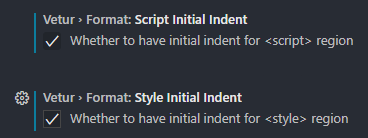
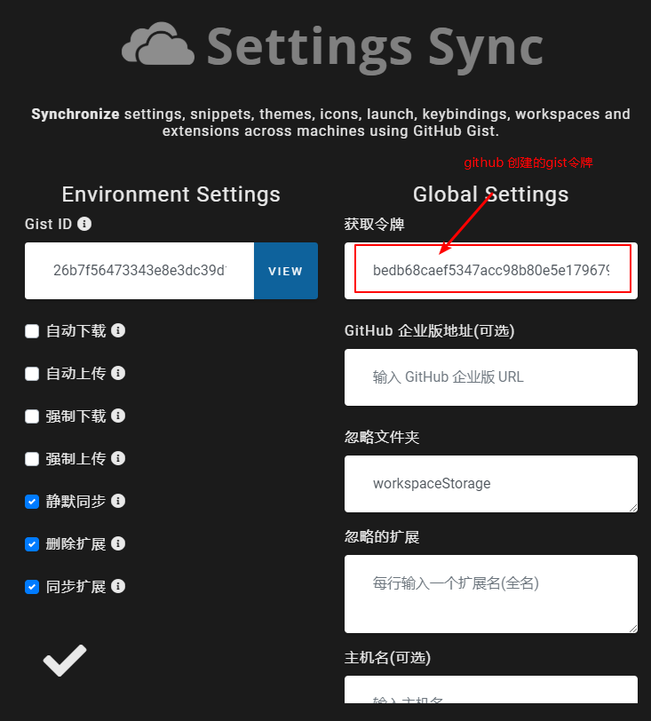

# VSCode

## 快捷键

| 快捷键                 | 说明                                   |
| ---------------------- | -------------------------------------- |
| Ctrl + Shift + L       | console.log    console utils 快捷键    |
| Ctrl + U               | 光标返回到上一个位置                   |
| Ctrl + Shift + F       | 全局搜索                               |
| Ctrl + P               | 在当前项目工程里，全局搜索文件名       |
| F2                     | 已重构的方式进行重命名                 |
| Ctrl + Backspace       | 删除光标之前的一个单词                 |
| Ctrl + Delete          | 删除光标之后的一个单词                 |
| Alt + 鼠标点击任意位置 | 同时出现多个光标                       |
| Alt + Shift + 鼠标拖动 | 同时出现多个光标                       |
| Alt + ↑/↓              | 将该行代码向上/下移动                  |
| Alt + ←/→              | 光标移动到上一个/下一个位置            |
| Alt + Shift + ↓        | 向下复制当前行                         |
| Ctrl + ←/→             | 在单词之间移动光标                     |
| Ctrl + Shift + \       | 跳转到成对符号的另一端                 |
| Ctrl + Tab             | 切换文件                               |
| Ctrl + PgUp/PgDn       | 切换文件                               |
| Ctrl + Enter           | 换行    Shift向上换行                  |
| Alt + Shift + F        | 格式化代码                             |
| Ctrl + B               | 显示/隐藏侧边栏                        |
| !                      | 自动生成一套HTML代码                   |
| Ctrl + \               | 向右拆分编辑器                         |
| Ctrl + Shift + N       | 重新开一个软件窗口                     |
| Ctrl + N               | 新建文件                               |
| Ctrl + W               | 关闭当前文件                           |
| Ctrl + 1、2            | 聚焦到第1、第2个编辑器                 |
| Alt + B                | Open in default Browser     插件快捷键 |
| Ctrl + +/-             | 放大或者缩小整个vscode内容             |
| Ctrl + J               | 显示/隐藏控制台                        |
| Ctrl + Shift + W       | 关闭软件的当前窗口                     |
| Ctrl + Shift + P       | 显示命令面板                           |

* 选中某个文本，然后反复按住快捷键「 **Cmd + D** 」键（windows 用户是按住「**Ctrl + D**」键）， 即可将全文中相同的词逐一加入选择。
* 方法重构：选中某一段代码，这个时候，代码的左侧会出现一个「灯泡图标」，点击这个图标，就可以把这段代码提取为一个单独的函数。
* 创建多层子文件夹，可以在新建文件夹的时候，如果直接输入`aa/bb/cc`

## `.vscode`文件夹的作用

为了统一团队的 vscode 配置，我们可以在项目的根目录下建立`.vscode`目录，在里面放置一些配置内容，比如：

- `settings.json`：工作空间设置、代码格式化配置、插件配置。
- `sftp.json`：ftp 文件传输的配置。

`.vscode`目录里的配置只针对当前项目范围内生效。将`.vscode`提交到代码仓库，大家统一配置时，会非常方便。

## 插件

Chinese (中文支持)

Auto Close Tag (自动闭合HTML/XML标签)

Auto Rename Tag (自动完成另一侧标签的同步修改)

Beautify (格式化 html ,js,css)

Bracket Pair Colorizer(给括号加上不同的颜色，便于区分不同的区块)

Debugger for Chrome(映射vscode上的断点到chrome上，方便调试)

ESLint(js语法纠错，可以自定义配置)

GitLens(方便查看git日志)

HTML CSS Support (智能提示CSS类名以及id)

HTML Snippets(智能提示HTML标签，以及标签含义)

jQuery Code Snippets(jQuery代码智能提示)

Markdown Preview Enhanced(实时预览markdown)

Markdown All in One

markdownlint(markdown语法纠错)

Material Icon Theme(vscode图标主题)

open in browser(右键快速在浏览器中打开html文件)

Path Intellisense(自动提示文件路径)

Vetur(Vue多功能集成插件，错误提示等)

* 

* ```
  //vetur格式化时初始化script缩进
  //vetur格式化时初始化style缩进
  ```

npm Intellisense(require 时的包提示)

Lombok Annotations Support for VS Code. (简化POJO， 很惊喜)


Atom One Dark Theme

One Dark Pro

Live Server

vscode-icons

Git History

TODO Highlight

JavaScript(ES6) code snippets

javascript console utils

Code Spell Checker

Local History

Better Comments

CSS Peek

Vue CSS Peek

Import Cost

Search node_modules

Polacode-2020：生成代码截图 

Paste JSON as Code

Project Manager

Vue VSCode Snippets

Bookmarks

Vue VS Code Extension Pack

iview-snippets

Path Intellisense

```
"path-intellisense.mappings": {
   "@":"${workspaceRoot}/src"
}
```

Prettier


### EditorConfig

EditorConfig和Prettier一样，都是用来配置格式化代码的，这个格式化代码，要和`lint`配置相符

EditorConfig不是什么软件，而是一个名称为.editorconfig的自定义文件。该文件用来定义项目的编码规范，编辑器的行为会与.editorconfig 文件中定义的一致，并且其**优先级比编辑器自身的设置要高**，这在多人合作开发项目时十分有用而且必要

webstorm默认支持EditorConfig，

ATOM、Sublime、VS Code则需要安装EditorConfig插件。


当打开一个文件时，EditorConfig插件会在打开文件的目录和其每一级父目录查找.editorconfig文件，直到有一个配置文件root=true。

EditorConfig的配置文件是从上往下读取的并且最近的EditorConfig配置文件会被最先读取. 匹配EditorConfig配置文件中的配置项会按照读取顺序被应用, 所以最近的配置文件中的配置项拥有优先权

如果.editorconfig文件没有进行某些配置，则使用编辑器默认的设置


Eslint 仅仅支持对 js 文件的校验


```
# http://editorconfig.org
# 控制.edetorconfig是否生效
root = true

# 匹配全部文件
[*]
# 缩进风格
indent_style = space
# 缩进长度
indent_size = 2
# 使用空格替代tab，并且一个tab会被替换为2个空格。

# Unix-style newlines with a newline ending every file
# 换行符lf
end_of_line = lf

# Set default charset
charset = utf-8

# 是否删除行尾的空格
trim_trailing_whitespace = true

# 是否在文件的最后插入一个空行
insert_final_newline = true

[*.md]
trim_trailing_whitespace = false

# Makefile表示
[Makefile]
indent_style = tab
```

```
indent_style    设置缩进风格(tab是硬缩进，space为软缩进)
indent_size     用一个整数定义的列数来设置缩进的宽度，如果indent_style为tab，则此属性默认为tab_width
tab_width       用一个整数来设置tab缩进的列数。默认是indent_size
end_of_line     设置换行符，值为lf、cr和crlf
charset         设置编码，值为latin1、utf-8、utf-8-bom、utf-16be和utf-16le，不建议使用utf-8-bom
trim_trailing_whitespace  设为true表示会去除换行行首的任意空白字符。
insert_final_newline      设为true表示使文件以一个空白行结尾
root        　　　表示是最顶层的配置文件，发现设为true时，才会停止查找.editorconfig文件
```

### Settings Sync

vscode 配置云同步



## 配置

### 自动保存

Auto Save

onFocusChange

### 修改字体大小

Font Size

14

### 自动换行

Word Wrap

on

### 渲染空格

Render Whitespace

all

### 代码缩进

Tab Size

4/2

## 备注

vscode支持Emmet语法

日常开发中，建议用可以用 Prettier 做代码格式化，然后用 eslint 做校验。

jsconfig.json 该`exclude`属性可以通过指定不属于源代码的文件夹来提高IntelliSense的性能。

### 解决VSCode对于java某些API的Access restriction造成的警告

在`项目目录/.settings/org.eclipse.jdt.core.prefs`中添加`org.eclipse.jdt.core.compiler.problem.forbiddenReference=ignore` 

来忽略此类警告

[该解决方法来自github](https://github.com/redhat-developer/vscode-java/issues/120)