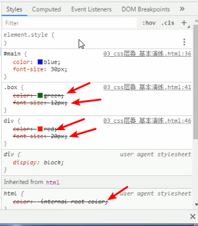
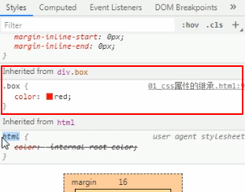
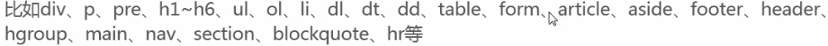
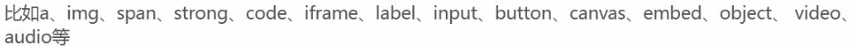
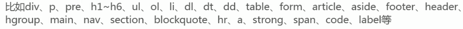
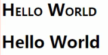
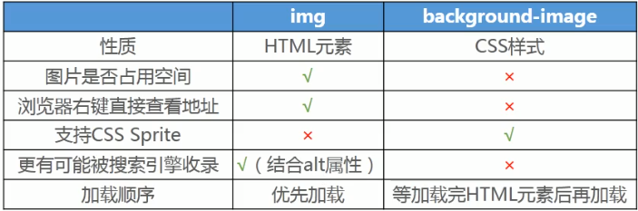
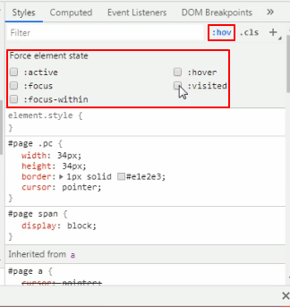
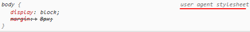

# CSS

CSS（Cascading Style Sheets，层叠样式表）是用来控制网页在浏览器中的显示外观的声明式语言。

最大的优势是层叠，意为多个选择符之间具有特定的优先级。

## 推荐网站

[官方文档](https://www.w3.org)

[ALL STANDARDS AND DRAFTS](https://www.w3.org/TR/?tag=css)

[CSS2.2官方文档](https://www.w3.org/TR/CSS22/)

[CSS属性查询表](https://www.w3.org/TR/CSS22/propidx.html)

[MDN](https://developer.mozilla.org/zh-CN/)

[CSS属性的可用性](https://caniuse.com)

[寻找合适的颜色](https://flatuicolors.com/)

首推MDN，然后是官网

## 名词解释

### 层叠

CSS允许多个相同的属性层叠到同一个元素上，层叠后只有一个会生效。

当应用两条不同级别(权重不同)的规则到一个元素时，根据权重决定优先级。

当应用两条同级别(相同权重)的规则到一个元素的时候，**写在后面的就是实际使用的规则**。

或者说，后面的会层叠掉前面的样式。

css最大的优势就是层叠特性，战胜了svg成为了标准。



### 继承

* 在默认情况下，一些css属性继承当前元素的父元素上设置的值，有些则不继承。
* 元素**优先**使用自己的CSS属性，自己没有设置才有可能继承

* 哪些属性属于默认继承很大程度上是由常识决定的。

  比如color、font-size等属性都是可以继承的

  

* CSS属性继承的是计算值(**计算后的值**)，并不是当初编写属性时的指定值(字面值)

#### 控制继承

CSS 为控制继承提供了四个特殊的**通用属性值**。每个css属性都接收这些值。

* `inherit`，设置该属性会使子元素属性和父元素相同。实际上，就是 "开启继承".

  不能继承的属性，一般可以使用inherit  **强制继承**

* `initial`，设置属性值和浏览器默认样式相同。如果浏览器默认样式中未设置且该属性是自然继承的，那么会设置为 `inherit` 。

* `unset`，将属性重置为自然值，也就是如果属性是自然继承那么就是 `inherit`，否则和 `initial`一样

* revert，只有很少的浏览器支持。

#### 重设所有属性

all属性是所有属性的速记属性。

CSS 的 shorthand 属性 `all` 可以用于同时将这些继承值中的一个应用于（几乎）所有属性。它的值可以是其中任意一个(`inherit`, `initial`, `unset`, or `revert`)。这是一种撤销对样式所做更改的简便方法，以便回到之前已知的起点。

### 优先级(权重)

浏览器是根据优先级来决定当多个规则有不同选择器对应相同的元素的时候需要使用哪个规则。

- 一个元素选择器不是很具体 — 会选择页面上该类型的所有元素 — 所以它的分数就会低一些。
- 一个类选择器稍微具体点 — 它会选择该页面中有特定 `class` 属性值的元素 — 所以它的分数就要高一点。

#### 优先级的计算

1. **千位**： 如果声明在 `style` 的属性（内联样式）则该位得一分。这样的声明没有选择器，所以它得分总是1000。
2. **百位**： 选择器中包含ID选择器则该位得一分。
3. **十位**： 选择器中包含类选择器、属性选择器或者伪类则该位得一分。
4. **个位**：选择器中包含元素、伪元素选择器则该位得一分。

**注**: 通用选择器 (`*`)，组合符 (`+`, `>`, `~`, ' ')，和否定伪类 (`:not`) **不会影响优先级**，即优先级最低。

**警告:** 在进行计算时不允许进行进位

数值越大优先级越高。

#### `!important`

覆盖所有上面所有优先级计算。

用于修改特定属性的值， 能够覆盖普通规则的层叠。

覆盖 `!important` 唯一的办法就是另一个 `!important` 具有 相同*优先级* 而且顺序靠后，或者更高优先级。

**强烈建议除了非常情况不要使用它**

`!important` 改变了层叠的常规工作方式，它会使调试 CSS 问题非常困难，特别是在大型样式表中

### 视口

viewport

能够直接看到网页内容的那部分区域叫做视口

### 画布

浏览器所能滚动展示的所有东西，这一块区域叫做画布

## CSS的作用

可以给网页的每一个元素 **设置样式**，可以对元素进行 **布局**，让网页更加精美。

浏览器会根据 CSS 的样式定义将其选定的元素显示为恰当的形式。

## CSS工作原理

### 浏览器加载网页的基本步骤

* 加载HTML文件
* 将HTML文件转化为DOM（Document Object Model），DOM是文件在计算机内存中的表现形式
* 浏览器拉取该HTML相关的大部分资源
* 浏览器拉取到CSS之后会进行解析、渲染树(将css规则应用到对应的DOM节点)
* 渲染树依照应该出现的结构进行布局
* 网页展示在屏幕上（这一步被称为着色）


## 三种添加CSS的方式

### 外部样式表  (最为推荐)

external style sheet

> 外部.css文件
>
> `<link>`引入

#### 指定CSS文件的编码

> 对于独立的css文件，如果含有中文，比如`font-family:"华文宋体"`，需要指定css文件的编码。

```css
@charset "utf-8";
```

#### 在CSS文件中引入外部样式表

```css
@import url("./base.css");
@import "./base.css";

这三种都是可以的，但是推荐加引号
url("./base.css")
url('./base.css')
url(./base.css)
```

这种方式引入css没有`<link>`效率高，但是这种方式webpack会将多个css打包成一个文件

### 内部样式表

文档样式表，document style sheet

内嵌样式表，embed style sheet

> `<head>`中使用`<style>`标签

### 内联样式(行内样式)

inline style

>在html元素中添加style属性
>
>最好不要使用这种方式，除非要动态改变样式可以考虑。
>
>难以维护

## 元素类型

相关见下display属性

### 根据元素的显示类型分类

> 能不能在同一行显示

#### 块级元素

block-level elements

`display:block`、`display:list-item`等

* 块级元素在浏览器显示时，通常会**以新行**来开始（和结束），独占父元素的一行。
* 块级元素都是非替换元素

* 可以随意设置宽高，高度默认由内容撑起。

* `<div> `元素是块级元素，可用于组合其他 HTML 元素的容器。
* 

#### 行内级元素(内联元素)

inline-level elements

`display:inline`，默认

- 行内级元素在显示时通常**不会以新行**开始，多个行内元素可以在父元素的同一行显示
- 行内非替换元素
  * 设置宽高无效，宽高由内容决定
  * 设置 **上下外边距** 无效
- 行内级替换元素可以随意设置宽高
- `<span> `元素是行内级元素，可用作文本的容器。
- 

### 根据元素的内容类型分类

> 是否浏览器会替换掉元素
>
> 这种分类方式相对于上一种使用较少

#### 替换元素

replaced elements

* 元素本身没有实际内容，浏览器根据元素的类型和属性，来决定元素的具体显示内容
* 可以随意设置宽高
* 替换元素都是行内元素
* 

#### 非替换元素

non-replaced elements

* 和替换元素相反，元素本身有实际内容的，浏览器会**直接将其内容显示**出来，而不需要根据元素的类型和属性来判断到底显示什么内容
* 

### 总结


### 行内非替换元素的注意点

* 以下属性对行内非替换元素不起作用

  width、height、margin-top、margin-bottom

* 以下属性对行内非替换元素的效果比较特殊

  * 上下方向的padding，上下会多出区域，但是这个区域**不占空间**
  * 上下方向的boder，上下会多出区域，但是这个区域**不占空间**
  * **解决方式**，将元素修改为inline-block

## 元素之间的空格

> 行内级元素的代码之间如果有空格或者换行符，会被解析成空格，多个连续空格或者换行符解析为一个空格

解决方法：

* 元素代码之间不要留空格或者换行符，**不推荐**

* 使用注释把空格或者换行符注释，**不推荐**

* 空格也是字符，设置父元素的font-size为0，然后在元素中重新设置自己需要的font-size，

  * 不推荐，**Safari不支持**

  * ```css
    body {
        font-size:0;
    }
    
    span, strong, div {
        font-size:16px;
    }
    ```

* 给元素加浮动，float，**常用**，浮动脱离标准流，在自己的流里面排布

  浮动会触发**BFC**，给浮动元素形成结界

## 元素之间的嵌套关系

* 块级元素、行内块级元素(inline-block)，一般情况下可以嵌套任意元素
  * 特殊，p元素中不可以嵌套div
* 行内元素(`display:inline`)(span、strong、a等)里面，一般不要嵌套块级元素

## 元素之间的层叠关系


### z-index

用来设置定位元素的层叠顺序，即仅对定位元素有效

默认值：auto

z轴，垂直屏幕向外

比较原则：

* 如果是兄弟关系
  * z-index越大，层叠在越上面
  * z-index相等，写在后面的那个元素层叠在上面
* 如果不是兄弟关系
  * 各自从元素自己以及祖先元素中，找出最邻近的两个定位元素进行比较
  * 而这2个定位元素必须设置z-index的具体数值

## [CSS选择器](https://www.runoob.com/cssref/css-selectors.html)

> 每个CSS规则都以一个选择器或一组选择器为开始，去告诉浏览器这些规则应该应用到哪些元素上。

### 专一性

通常情况下，两个选择器可以选择相同的HTML元素。

级联规则和专用规则，用来控制在发生碰撞时哪条规则将获胜。

#### 级联规则

> 对于同类选择器，稍后的样式将覆盖以前的样式

#### 专用规则

> 类选择器和元素选择器选中相同元素，类将获胜，无论前后。
>
> 一个类被描述为比元素选择器更具体，或者具有更多的特异性，所以它获胜了。

### 选择器的类型

#### class选择器

```
.paragraph {
     color:red;
}
```

##### 针对类的特定元素

```
h1.highlight {

}
```

##### 针对类的特定类

```
选择同时具有notebox和warning两个类的元素
.notebox.warning {
    border: 4px solid orange;
    font-weight: bold;
}
```

#### id选择器

> 唯一
>
> ID具有很高的特异性，并且会推翻大多数其他选择器
>
> 在大多数情况下，最好是在元素中添加一个类而不是使用ID

```
#para1 {
     color:red;
}
```

#### 元素选择器

type selectors

标签选择器、类型选择器

```
p {
     color:red;
}
```

#### 属性选择器

根据元素上某个属性的存在来选择元素

```css
选中含有title属性的元素
[title]{
    
}
```

```
根据a元素的title属性是否存在来选择元素
a[title] {

}
```

根据具有特定值的属性的存在来选择元素

```
a[href="https://example.com"] {

}
```

#### 伪类选择器

> 为元素的某些状态设置样式

```
a:hover {

}
```

##### `:hover`

> 鼠标移到元素上面时添加的样式

##### `:active`

> 向活动的元素添加样式
>
> 当点击元素时，元素变成活动的

##### `:visited`

> 向访问过的链接添加特殊的样式。

#### 伪元素选择器

> 选择元素的某个部分而不是元素本身

##### ::first-line

> 始终选择元素内的文本的第一行

```
p::first-line { }
```

##### :: before和:: after

> 与`content`属性一起使用，来通过CSS将内容插入文档中

#### 组合选择器

##### 并集选择器(重要)

```
当选择器列表中有无效选择器，整个规则将被浏览器忽视
h1, .special { 
  color: blue; 
} 
```

##### 交集选择器(重要)

两个选择器紧挨着

```css
#header.title{
    
}
选择到id为header且含有title类的元素
```

##### 后代选择器(最重要)

后代选择器四个层级，超过四个想其它方案

```css
div元素里面的span元素，包括直接、间接子元素
div span{
    
}
```

##### 子选择器(重要)

```css
.box类的元素里面的直接span子元素
.box>span{
    
}
```

##### 相邻兄弟选择器

```css
div元素后面紧挨着的p元素，div和p必须是兄弟关系
div+p{
    
}
```

##### 全兄弟选择器

```css
div元素后面的所有p元素，div和p必须是兄弟关系
div~p{
    
}
```

##### 选择器嵌套

```
.login {
  .logo {
  
  }
}

相当于
.login {

}
.login.logo {

}
选择class是login的元素内所有class是logo的元素
```

#### 通用选择器

> *匹配所有元素

```
* {
  color: green;
}
```

用来清除浏览器的默认样式，比如内边距、外边距。

效率比较低，会遍历设置所有元素，所以一般不这么做。

通常的做法是把要清除内边距、外边距的元素统一一个个列出来

```css
body,div,p{
    margin:0;
    padding:0;
}
```

## 伪类

pseudo-classes

* 为什么叫伪类？
  * 不需要在元素上添加class，自动产生的类

### 动态伪类

**官方推荐顺序**：link、visited、focus、hover、active   (lv  f  ha)

直接给a元素设置样式，相当于给a元素的所有动态伪类都设置了该样式

#### `:link`

通常用于a元素

`a:link`    未访问的链接，没有点击过的链接

交集选择器

#### `:visited`

通常用于a元素

`a:visited`   已访问的链接，点击过一次的链接

交集选择器

#### `:hover`

鼠标悬浮在元素上时

**使用注意**：hover只有放在link和visit后面才会生效

#### `:active`

元素处于激活状态时，鼠标在元素上长按未松开时

**使用注意**：active只有放在hover后面才会生效

#### `:focus`

通常用于a元素和input元素

指当前拥有输入焦点的元素(能够接收键盘输入)

tab键，切换焦点

a元素也可以获取焦点

##### 去掉a元素默认的`:focus`效果

* 方式一，隐藏轮廓

  ```css
  隐藏a元素获得焦点时的轮廓
  a:focus{
      outline:none;
  }
  ```

* 方式二

  ```html
  tabindex可以调整tab键选中元素的顺序
  <a tabindex="-1" href="#">xxx</a>
  ```

### 目标伪类

`:target`

用得比较少，用于锚点，设置锚点定位元素的样式

```css
:target{
    
}
```

### 元素状态伪类

`:enabled`、`:disabled`、`checked`

用得比较少

### 结构伪类

#### `:nth-child()`

* `:nth-child(3)`，第3个直接子元素

* `:nth-child(n)`，n为自然数：0，1，2，3 ......

* `:nth-child(2n)`     =    `:nth-child(even)`  ，  偶数

* `:nth-child(2n+1)`     =    `:nth-child(odd)`   ，奇数
* `:nth-child(-n+5)`     前5个

##### `:nth-last-child()`

倒数的`:nth-child()`

##### `:first-child()`

= `:nth-child(1)`

##### `:last-child()`

= `:nth-last-child(1)`

##### `:only-child()`

是父元素中唯一的子元素

#### `:nth-of-type()`

**同类型**中的第n个同级兄弟元素

##### `:nth-last-of-type()`

倒数的`:nth-of-type()`

##### `:first-of-type()`

= `:nth-of-type(1)`

##### `:last-of-type()`

`:nth-last-of-type(1)`

##### `:only-of-type()`

同级同类型唯一的元素

#### `:root`

根元素，就是HTML元素

```css
html{
    
}
等同于
:root{
    
}
```

#### `:empty`

空元素，元素中没有内容的元素

### 否定伪类

`:not(x)`

选中除选择器x选中的其他元素

x是一个简单选择器：元素选择器、通用选择器、属性选择器、类选择器、id选择器、伪类(除否定伪类)

能不用尽量别用，通常直接用class选择器

## 伪元素

pseudo-**elements**

伪元素也是 **元素**，伪元素可以看成是  **行内元素**

伪元素可以写一个冒号，或者两个冒号，但是 **通常写两个冒号**，与伪类做区分

### `::before`和`::after`(重要)

在一个元素的内容之前/后插入其他内容(可以是文字、图片)

content属性就是为元素的内容，**content属性不能省**，可以`content:""`

```css
插入文本
span::before{
    content:"111";
    color:red;
    margin-left:20px
}

插入图片
span::before{
    content:url("../img/apple.png");
}
```

### `::first-line`

第一行

不常用


### `::firet-letter`

第一个字/字母

不常用


## 函数

> 虽然大多数值是相对简单的关键字或数值，但也有一些可能的值以函数的形式出现。

### `calc()`函数

> 这个函数允许您在CSS中进行简单的计算
>
> calculate的缩写，CSS3新增，为元素指定动态宽度、长度等，注意此处的动态是计算之后得一个值

```
width: calc(90% - 30px);
```

## 属性

| 属性         | 描述                                                         |
| ------------ | ------------------------------------------------------------ |
| color        | **前景色**(包括文字颜色)                                     |
| width/height | 宽度/高度，不适用于非替换行内元素，比如span                  |
| transform    | 属性允许你旋转，缩放，倾斜或平移给定元素。这是通过修改CSS视觉格式化模型的坐标空间来实现的。 |

### 速记属性(ShortHands)(缩写属性)

> 一些属性，如 `font`, `background`, `padding`, `border`, and `margin`等属性称为速记属性--这是因为它们允许您在一行中设置多个属性值，从而节省时间并使代码更整洁。
>
> 使用速记属性可以 **减小css文件的体积**，字符变少了

**警告：**虽然速记经常允许您忽略值，但它们会将**不包含**的任何值重置为它们的**初始值**。这确保使用了一组合理的值。但是，如果您期望速记只更改传入的值，这可能会使您感到困惑。

### 空格

> 在CSS中，属性、属性值中的空格需要小心。

### 文本属性

#### text-decoration

>  设置文本的修饰线外观，下划线、删除线等

* none，无任何装饰线，可以去除a元素默认的下划线
* underline，下划线
  * u、ins元素默认就是设置了`text-decoration:underline`，这两个元素不常用
* overline，上划线
* line-through：中划线，删除线

#### letter-spacing

>  字母间距，默认是0px

#### word-spacing

>  单词间距，默认是0px

#### text-transform

> 设置文本的大小写转换

* capitalize，首字母大写
* uppercase，全部大写
* lowercase，全部小写
* none，没有任何影响，默认值

#### text-indent

> 设置**第一行**内容的缩进
>
> `text-indent:2em`缩进两个文字的大小

应用：

```css
隐藏文字
text-indent:-999px
```

#### text-align

> 设置 **元素内容** 在元素中的水平对齐方式

* left，默认
* right
* center
* justify，不常用
  * 两端对齐，两边都顶住
  * 会改变词间距
  * 对最后一行没有效果

#### text-align-last

> 设置 **元素内容最后一行** 在元素中的水平对齐方式

#### text-shadow

> 设置文字的阴影，
>
> `<shadow-t> = <length>{2,3} && <color>?`
>
> 参数含义和box-show一样，
>
> text-shadow同样适用于`::first-line`、`::first-letter`

### 字体属性

#### font-size

> em和%，相对于父元素的font-size
>
> 一般默认是16px

#### font-family

> 设置文字的字体名称，支持中文名称。中文字体名称有对应的编码，如：`\5b8b\4f53`。
>
> 浏览器去读取操作系统支持的字体，`C:/Windows/Fonts`。
>
> 为了防止设置的字体刚好在操作系统中不存在，在font-family中设置多个字体，前面的优先，使用操作系统支持的字体。如果都不支持，则使用操作系统默认的字体，windows为微软雅黑
>
> 有空格的字体名要加引号，编码需要加引号
>
> 一般情况下，英文字体只适用于英文，中文字体同时适用于中文和英文。
>
> 如果希望中英文分别使用不同的字体，应该先将英文字体写在前面，中文字体写在后面
>
> serif有衬线，sans-serif无衬线，花体和非花体
>
> monospace，字体等宽

网络字体

[字体在各平台的占有率情况](https://www.cssfontstack.com)

[字体选用](https://fonts.google.com)

[字谈字畅](https://www.thetype.com)

#### font-weight

字体粗细

* 12px/1.5
* 100|200|...|700|800|900，每个数字表示一个重量，700比较常用
* normal，400，默认
* bold，700

#### font-style

主要用来设置斜体

* normal，常规显示，默认
* italic，用字体的斜体显示，必须字体支持斜体
* oblique，文本倾斜显示，让文字倾斜，无论字体是否支持斜体

#### font-variant

很少用



#### line-height

* 用于设置文本的最小行高

* 可以先简单理解为一行文字所占据的高度

* 严格定义：两行文字基线(baseline)之间的间距

  基线：与最小字母x最底部对齐的线

  顶线和底线之间就是font-size的大小

  font-size  +  行距  =  line-height

  

* 行高一般比文字高，行高=文字的高度+行距，行距被文字上下等分

* 元素被内容撑起来，通常是指**被行高撑起来**

* line-height设置时必须**带单位**

* 为什么设计行高？

  * 一看就知道，要横着读

* 应用：假设div中只有一行文字，让这行文字在div内部 **垂直居中**

* **height和line-height的区别**

  * height：元素的整体高度
  * line-height：元素每一行文字所占据的高度

#### font

速记属性，可以将字体的所有设置放在font里面

```css
规则：
顺序：
font-style font-variant font-weight font-size/line-height font-family
font-style font-variant font-weight可以任意调换顺序，也可以省略
/line-height可以省略，如果不省略，必须跟在font-size后面
font-size、font-family不可以调换顺序，不可以省略

font-size:30px;
font-famile:"宋体";
font-weight:bold;
font-style:italic;
line-height:50px;
font-variant:small-caps;
等同：
font:italic small-caps bold 30px/50px "宋体"

font-family: "宋体";
font-size:16px;
font-weight:normal;
等同：
font:normal 16px 宋体;
```

### 轮廓属性

元素轮廓是绘制于元素周围的一条线，位于border的外围

#### outline

速记属性，一般使用outline。

outline-style(轮廓样式)、outline-width(轮廓宽度)、outline-color(轮廓颜色)

### 列表属性

可继承的，所以设置给ol、ul元素，默认也会应用到li元素

#### list-style

速记属性，没有顺序要求

实际开发中none用得最多，li元素前面标记通常自定义

```css
ul{
    list-style:none;
    padding:0;
    margin:0;
}
```

#### list-style-type

设置li元素前面标记的样式

disc(实心圆，默认)、circle(空心圆)、square(实心方块)

有序：decimal(阿拉伯数字)，lower-roman(小写罗马数字)，upper-roman(大写罗马数字)

#### list-style-image

设置某张图片为li元素前面的标记，会覆盖list-style-type，很少用

#### list-style-positon

设置li元素前面标记的位置，

* outside，标记不算在li内容之内，默认

* inside，标记算在li内容之内

### 背景属性

#### background-color

> 设置元素的背景颜色

#### background-image

> 设置元素的背景图片

* 会盖在(不是覆盖)background-color的上面

* 可以设置多张，用逗号分隔，默认显示的是第一张，当第一张不可用的时候往后依次找可用的图片，其他后面的图片按顺序层叠在下面

* 注意：如果设置了背景图片后，元素没有具体的宽高，背景图片是不会显示出来的，即**background-image是不会把盒子撑起来的**

#### background-repeat

> 设置背景图的平铺行为

* repeat，平铺，默认 
* repeat-x，只在水平方向平埔
* repeat-y，只在垂直方向平铺
* no-repeat，不平铺

#### background-size

> 设置背景图片的大小

* auto，以背景图片本身大小显示，默认
* cover，对图片进行等比拉伸，让图片覆盖整个元素，会使图片显示不完整
* contain，对图片进行等比拉伸，直到在某一个方向上填满元素
* `<percentage>`、具体的大小：
  * 一个值，水平方向的值
  * 两个值，第一个值是水平方向，第二个值是处置垂直方向
  * 百分比是相对于背景区

#### background-position

> 设置背景图片在水平、垂直方向上的具体位置

* 两个值，第一个值设置水平方向，第二个值设置垂直方向
* 水平方向：left、right、center
* 垂直方向：top、center、bottom
* 具体的大小，图片离某个方向的距离
* 如果只设置了一个值，另一个方向默认是center

#### background-attachment

* scroll，背景图片随元素一起滚动，默认
* local，背景图片随元素以及元素内容一起滚动
* fixed，背景图片相对于浏览器窗口固定

#### 速记属性

background

`image position/size repeat attachment color`

background-size可以省略，如果不省略，/background-size必须跟在background-position后面。

其他属性也可以省略，而且顺序任意

### display

能修改元素的显示类型

* block，让元素显示为块级元素
  * 浏览器给块级元素，如div、p、h1等元素设置了`display:block`
* inline，让元素显示为行内级元素
  * 默认都是inline
  * 将块级元素转回到行内元素时使用
* none，隐藏元素，**不占用空间**，盒子直接被移除了
* inline-block，让元素同时具备行内级、块级元素的特征，行内块级元素
  * 可以在父元素的同一行显示
  * 可以随意设置宽高
  * 宽高默认由内容决定
  * 可以理解为：
    * 对外来说，他是一个行内级元素
    * 对内来说，它是一个块级元素
  * 用途：
    * 让行内非替换元素(a、span等)能够随意设置宽高
    * 让块级元素能够跟其他元素在同一行显示
* 

### visibility

设置元素是否可见，隐藏元素内容，依然**占用空间**

* visible，可见，默认
* hidden，隐藏

### overflow

控制内容溢出时的行为

* visible，溢出的内容依然可见，默认值
* hidden，溢出的内容隐藏
* scroll，溢出的内容被隐藏，但是可以滚动机制查看
  * 会一直显示滚动条区域
  * 滚动条区域占用的空间属于width、height
* auto，自动根据内容是否溢出来决定是否提供滚动机制
* `overflow-x` 和 `overflow-y`，可以分别设置水平垂直方向
* 建议直接使用`overflow`，因为目前`overflow-x` 和 `overflow-y`还没有成为标准，浏览器可能不支持

### work-break

设置单词是否可以断开换行

默认情况下，单词不会断开，会显示在一行

* break-all，都断开

### outline

> 元素得外轮廓

* **不占用空间**

* 默认显示在boder外面

* outline-width、outline-style、outline-color、outline，与boder用法类似

* 应用：

  * 去除a元素、input元素、textarea元素的focus轮廓效果

  * 查看网页布局

    ```css
    div {
        outline:1px solid red !important;
    }
    ```

### cursor

设置鼠标指针在(光标)在元素上面时的显示样式

* auto，浏览器自己决定
* default，操作系统默认的鼠标样式，小箭头
* pointer，小手
* text，竖线
* none，没有任何指针显示在元素上面

## CSS Sprite

CSS精灵、雪碧图

是一种CSS图像合成技术，将各种小图标合并到一张图片上，然后利用CSS的背景定位(background-position)来显示对应的图标

CSS Sprite的好处：

* 减少网页的http请求数量，加快网页响应速度，减轻服务器压力
* 减小图片总大小
* 解决了图片命名的困扰，只需要针对一张集合的图片命名

CSS Sprite的制作方法：

* PS
* 网站在线生成


## background-image和img的选择



总结

* img，作为网页内容的重要组成部分，比如广告图片、LOGO、产品图片等
* background-image，可有可无的。有，让网页更美观。无，也不影响用户获取完整的网页内容信息

## @规则

> 规则名和值

### @import

>将额外的样式表导入主CSS样式表

```
@import 'styles2.css';
```

### @media

> 允许您使用 媒体查询 来应用CSS，仅当某些条件成立(例如，当屏幕分辨率高于某一数量，或屏幕宽度大于某一宽度时)。

```
body {
  background-color: pink;
}

@media (min-width: 30em) {
  body {
    background-color: blue;
  }
}
使用@media创建样式表的一个部分，该部分仅适用于视口大于30em的浏览器。如果浏览器的宽度大于30em，则背景色将为蓝色。
```

## CSS里的颜色

* 关键词：`black`
  * 一般不用关键词
  * 一般用十六进制
* 十六进制：`#ff0001`
  * 十六进制和rgb函数的关系：ff对应255，00对应0，01对应1，即= rgb(255,0,1)，
  * #00ff00 可省略为 #0f0
  * 尽量用#rgb去替代#rrggbb，可以减少字符，减小css文件大小，加快网页响应速度
* rgb函数：`rgb(255,0,0)`
  * RGB颜色值越大，越靠近白色，越浅色
  * RGB颜色值越小，越靠近黑色，越深色
  * RGB颜色值一样的，一般是灰色
* rgba函数：`rgb(255,0,0,0.5)`
  * 关键字 **transparent** 等价于rgba(0,0,0,0)，完全透明
* HSL：`hsl(0,100%,50%)`  色相hue，饱和度saturation，亮度lightness
* HSLA：`hsl(0,100%,50%,0.5)`

[颜色转换工具](https://serennu.com/colour/hsltorgb.php)

### HSL函数


### rgba函数

```
rgba(255, 255, 255, 0.2)
```

前三个值（红绿蓝）的范围为0到255之间的整数或者0%到100%之间的百分数。这些值描述了红绿蓝三原色在预期色彩中的量。
第四个值，alpha值，制订了色彩的透明度/不透明度，它的范围为0.0到1.0之间，0.5为半透明。

**background-color设置为透明的方法**

```css
background-color:transparent;
或者
background-color: rgba(255,255,255,0.2);
```

## 盒子模型

> Box Model
>
> HTML中的每一个元素都可以看作是一个盒子


### 内容 content

盒子里面装的东西

background-color改变的是cotent+padding内的背景颜色

* width，height

  内容的宽高，

  auto是宽高的默认值

  块级元素默认占整行，设置的内容宽度小于父元素宽度，多余的宽度是 **未分配**

* min-width，min-height

  设置最小宽高，当浏览器窗口宽高小于设置的最小宽高时，浏览器窗口会出现滚动条

* max-width，max-height

  应用：inline-block元素，内容自动换行

### 内边距 padding

padding一般是用来设置父子元素之间的间距

### 外边距 margin

margin一般情况下是用来设置**兄弟元素**之间的间距

百分比相对于包含块的宽度

#### 元素水平居中

auto，浏览器自动计算的外边距

```css
margin:0 auto
等同于
margin:0 0 auto auto

区别于
text-align:center 是元素内容居中
```

#### 上下margin的折叠

> 左右永远不会折叠，左右相加

collapase  折叠

外边距折叠，外边距塌陷，外边距重叠

上下两个盒子靠在一起，取最大的margin作为外边距

* 上下两个盒子可以是兄弟元素，也可以是父子元素

  父子元素，子元素的margin传递给父元素，然后margin折叠

* 如何防止margin collapse？

  * 只设置其中一个元素的margin

    最好的方式，开发中一般也只设置一个元素的margin

#### 上下margin的传递

> 左右是不会传递的

##### margin-top的传递

如果块级元素的顶部线与父元素的顶部线 **重叠**，那么这个块级元素的margin-top值会传递给父元素

##### margin-bottom传递

如果块级元素的底部线与父元素的底部线 **重叠**，并且父元素的高度是auto，那么这个块级元素的margin-bottom值会传递给父元素

##### 如何防止出现传递

* 破坏"块级元素的底部线与父元素的底部线 **重叠** "这个条件
  * 给父元素设置padding-top/padding-bottom，不太好，会有内边距
  * 给父元素设置boder，不太好，会有边框宽度
* 触发 BFC：设置overflow为auto/hidden，**最好**的方法

### 边框 border

#### 基本属性

> border-width、boder-color、boder-style
>
> 边框宽度、边框颜色、边框样式，上右下左

#### 速记属性

一般规范顺序：边框宽度、边框颜色、边框样式，浏览器不区分顺序

```
boder:1px solid skyblue;   统一设置四个方向
boder-top:1px solid gray;  设置单个方向
```

#### 边框样式的取值

开发中常用dashed、solid

```
border-style:dotted solid double dashed; 
```

- 上边框是点状
- 右边框是实线
- 下边框是双线
- 左边框是虚线

#### 边框的形状

> 矩形、梯形、三角形等，所以可以用来做图形，尤其是**三角形**非常有用，做箭头


#### 边框的圆角

`boder-*-*-radius`，`*`表示占位

如：`boder-top-left-radius`、`boder-bottom-right-radius`，进行某个角的单独设置

* 一个值，圆的半径

  border-radius:20px；   边框的圆润程度    20px为半径的圆的弧度

* 两个值，第一个值是椭圆的水平半轴，第二个值是椭圆的垂直半轴，得到椭圆

  

* 速记属性：border-radius

* 可以用来画**圆**

* %单位，参考是当前元素的可见宽度：boder+padidng+width

### 速记属性

> margin、padding、border-width、boder-color、boder-style、border-radius

默认单位px

* 四个值

  顺序：从上开始顺时针，上右下左

* 三个值

  上右下，没有左，左边跟随右边的值

  ```css
  margin:0 1 2    等同于   margin:0 1 2 1
  ```

* 两个值

  上右，没有下，跟随上，没有左，跟随右

  ```css
  padding:0 1     等同于   padding:0 0 1 1
  ```

* 一个值

  上下左右均取自这一个值

### 阴影 box-shadow

给盒子设置一个或者多个阴影

每个阴影用`<shadow>`表示

多个阴影之间用逗号隔开，从前到后叠加

* **官方文档** 给出的属性设置语法：

  `<shadow> = inset? && <length>{2,4} && <color>?` ，解读：

  * ？，正则，表示0个或1个
  * {2，4}，正则，表示2到4个
  * inset这种没有尖括号的，表示值就是这个名字
  * `<length>`、`<color>`这种被尖括号包裹起来的，表示书写时需要写入具体值
  * && 逻辑与  ，没有顺序

* 参数说明：

  * 第一个`<length>`：水平方向的偏移，正数向右偏移
  * 第二个`<length>`：垂直方向的偏移，正数向下偏移
  * 第三个`<length>`：模糊半径
  * 第四个`<length>`：延伸距离
  * inset：外框阴影变成内框阴影
  * `<color>`阴影的颜色

* ```css
  示例
  设置一个阴影
  box-shadow: -15px 5px 10px 5px orange;
  
  设置多个阴影
  box-shadow: -5px 5px 10px,
              5px 0 10px
  ```

### box-sizing

> 设置盒子模型中宽高的行为

* content-box，内容盒子，默认

  含义：设置宽高只是指定内容的宽高

  padding、boder都是布置在width、height外边

  content-box是W3C标准盒子模型

* boder-box，**盒子的内减**，

  含义：设置宽高时是内容+内边距+边框的宽度

  padding、boder都是布置在width、height里边

  IE盒子模型(IE8以下浏览器)

* 

## BFC

block format context

结界，不受外界干扰

默认情况下，所有元素都没有触发BFC

如何触发BFC?

* 浮动可以触发
* 设置一个元素的overflow为非visible，hidden比较好

## 相对长度单位

[px、em、rem区别介绍](https://www.runoob.com/w3cnote/px-em-rem-different.html)

### px

> px像素（Pixel）。相对长度单位。像素px是相对于显示器屏幕分辨率而言的。

- IE无法调整那些使用px作为单位的字体大小；
- 国外的大部分网站能够调整的原因在于其使用了em或rem作为字体单位；
- Firefox能够调整px和em，rem，但是96%以上的中国网民使用IE浏览器(或内核)。

### em

> em是相对长度单位。相对于当前对象内文本的字体尺寸。如当前对行内文本的字体尺寸未被人为设置，则相对于浏览器的默认字体尺寸。
>
> 任意浏览器的默认字体高都是16px。
>
> 所有未经调整的浏览器都符合: 1em=16px。

- em的值并不是固定的；
- em会继承父级元素的字体大小。

### rem

> CSS3新增的一个相对单位。
>
> 用rem为元素设定字体大小时，仍然是相对大小，但相对的只是**HTML根元素**。这个单位可谓集相对大小和绝对大小的优点于一。
>
> 通过它既可以做到只修改根元素就成比例地调整所有字体大小，又可以避免字体大小逐层复合的连锁反应。

### 选择

对于只需要适配少部分手机设备，且分辨率对页面影响不大的，使用px即可 。

对于需要适配各种移动设备，使用rem，例如只需要适配iPhone和iPad等分辨率差别比较挺大的设备。

## 标准流(Normal Flow)

也叫常规流、正常流、文档流(document flow)

从左到右、从上到下顺序排列

默认情况下，兄弟元素互相不存在层叠现象


### 三种对元素进行定位和布局的方法

- 标准流：margin、padding
- 定位：position
- 浮动：float

### 标准流中margin、padding定位

在标准流中，可以使用margin、padding对元素进行定位。

其中margin还可以设置为负数

比较明显的缺点：

* 设置一个元素的margin或者padding，通常会影响标准流中其他元素的定位效果
* 不便于实现元素层叠的效果

### 脱标

脱离标准流

#### 脱标元素

`position:fixed`、`position:absolute`、`float`

注意：相对定位`position:relative`**并没有脱标**，仍然在标准流中，因为不管怎么移动，原有位置会保留

#### 脱标元素的特点

- 可以随意设置高度和宽度
- **宽高默认由内容决定**
- 不再受标准流约束
- 不再向父元素汇报宽高数据

#### [脱标元素和display有什么关系？](https://www.w3.org/TR/CSS2/visuren.html#dis-pos-flo)

P168

除了特殊的一些，基本上脱标后都变成了块级元素(block)

## position

> 指定一个元素（静态的，相对的，绝对或固定）的定位方法的类型。

- static：静态定位，默认值，就是标准流
- relative：相对定位
  - 相对于其正常位置(在标准流中原本的位置)进行定位。
  - 相对定位`position:relative`**并没有脱标**，仍然在标准流中，因为不管怎么移动，原有位置会保留
- absolute：绝对定位
  - 逐级往父元素找，直到这个父元素为**非static**的，就相对于这个元素进行定位，一直找到浏览器视口。
  - 定位参照对象是最邻近的定位祖先元素
  - 在大多数情况下，子元素的绝对定位都是相对于父元素进行定位
  - 如果希望子元素相对于父元素进行定位，又不希望父元素脱标，常用的解决方案是：
    - 父元素设置`position:relative`（让父元素成为定位元素，而且父元素不脱离标准流）
    - 子元素设置`position:absolute`
    - 简称为“**子绝父相**”
- fixed：固定定位，相对浏览器视口
  - 当**画布**滚动时，固定不动
- sticky：

常用到的值：left、right、top、bottom，在static中没作用

### 定位元素

position的值为非static

### 绝对定位元素

position值为absolute或者fixed的元素

对于绝对定位元素来说：

定位参照对象的宽度 = left + right + margin-left + margin-right + 绝对定位元素的实际占用宽度；

定位参照对象的高度 = top + buttom + margin-top + margin-bottom + 绝对定位元素的实际占用高度；

margin-left 、margin-right、 margin-top、margin-bottom的默认值是0

left、right、top、bottom的默认值是auto

### 总结


## float

> 定义元素在哪个方向浮动。会使元素向左或向右移动，直到自己的边界紧贴着包含块（一般是父元素）或者其他浮动元素的边界为止，其周围的元素也会重新排列。
>
> 相对于flex兼容性更好
>
> float最早是用来做图文环绕的

- none   默认值，元素不浮动
- left   元素向左浮动
- right   元素向右浮动
- inherit   从父元素继承float属性

### 清除浮动

#### 为什么要清除浮动？

> 浮动本质是用来做文字混排效果的，但是拿来做布局用，则会有很多的问题出现。
>
> 浮动元素不再占用原文档流的位置，所以它会对后面的元素排版产生影响。
>
> 清除浮动，是清除浮动后造成的影响。
>
> 解决父级元素因为子级浮动引起内部高度为 0 的问题。

#### 解决方法

1.父元素内尾部添加元素clear

```
html:
<div class="clear"></div>

<style>
.clear{
 clear: both;
}
</style>
```

2.父盒子使用伪类after清除float

```
.box:after {
    display: block;
    visibility: hidden;
    clear: both;
    content: "";
}
.box{
    zoom:1;/*解决兼容问题*/
}
```

## flex布局

> Flex 是 Flexible Box 的缩写
>
> (Flexible)弹性布局，比浮动布局简单
>
> flex布局是目前web开发中使用最多的布局方案，特别是移动端
>
> IE从10开始支持flex布局
>
> 传统的网页布局解决方案是基于盒子模型，依赖display属性+position属性+float属性。

### 两个重要的概念

#### flex container

开启flex布局的元素叫做flex container。

#### flex items

flex-container里面的直接子元素叫做flex items。

### 开启flex布局

设置display属性为flex或者inline-flex可以成为flex container

* flex：flex container以block-level形式存在，块级元素
* inline-flex：flex container以inline-level形式存在，行内元素

注意：一旦开启flex布局，flex items**不再区分**块级元素和行内元素

### flex布局模型


### 应用在flex container上的属性

#### flex-direction

> 决定主轴的方向
>
> flex items都是从main start到main end进行排列

- row：从左到右，默认
- row-reverse：从右到左
- column：从上到下
- column-reverse：从下到上

#### justify-content

> 决定了flex items在主轴上的对齐方式

- flex-start，与main start对齐，默认
- flex-end，与main end对齐
- center，居中对齐
- space-between
  - flex items之间的距离相等
  - 与main start、main end两端对齐
- space-evenly
  - flex items之间的距离相等
  - 与main start、main end之间的距离等于flex items之间的距离
- space-around
  - flex items之间的距离相等
  - 与main start、main end之间的距离等于flex items之间距离的一半


#### align-items

> 决定了flex items在交叉轴上的对齐方式

- normal，同stretch，默认值
- stretch，当flex items在交叉轴方向上的size为**auto**时，自动拉伸到填充flex container。
- flex-start，与交叉轴的cross start对齐
- flex-end，与交叉轴的cross end对齐
- center，居中对齐
- baseline，与第一行文字的基线对齐

#### flex-wrap

> 决定了如何换行。
>
> 默认情况下，所有的flex items都会在同一行显示，过宽会压缩

* nowrap，不换行，一行，默认
* wrap，自动换行，多行
* wrap-reverse，多行，在交叉轴上反转，第一行在cross end

#### flex-flow

> flex-direction||flex-wrap的缩写属性

可以省略，顺序任意

#### align-content

> 决定了 **多行** flex items在交叉轴上的对齐方式，用法与justify-content类似
>
> 如果只有一行，该属性不起作用

* stretch，与align-items的stretch类似，默认值
* flex-start，与交叉轴的cross start对齐
* flex-end，与交叉轴的cross end对齐
* center，居中对齐
* space-between
* space-evenly
* space-around

### 应用在flex items上的属性

#### order

> 决定了flex items的排布顺序
>
> 任意整数
>
> 值越小就越排在前面
>
> 默认是0

#### align-self

> 设置该item自己的交叉轴对齐方式
>
> 覆盖flex container设置的align-items

#### flex-grow

> 决定了flex items如何扩展
>
> 剩余的size如何分配给flex item

* 任意非负数，默认是0
* 当flex container在主轴方向上有剩余size时，才会有效

* 如果所有flex items的flex-grow总合sum超过了1，每个flex item扩展的size为：
  * flex container的剩余size * flex-grow / sum
* 如果所有flex items的flex-grow总合sum不超过1，每个flex item扩展的size为：
  * flex container的剩余size * flex-grow
* flex items扩展后的最终size不能超过max-width/max-height

#### flex-shrink

> 决定了flex items如何收缩

* 默认值是1
* 当flex items在主轴方向上超过了flex container的size时，才会有效
* 如果所有flex items的flex-shrink总和超过了1，每个flex item收缩的size为：
  * flex items超过flex container的size * 收缩比例 / 所有flex items的收缩比例之和
* 如果所有flex items的flex-shrink总和sum不超过1，每个flex item收缩的size为：
  * flex items超过flex container的size * sum * 收缩比例 / 所有flex items的收缩比例之和
  * 收缩比例 = flex-shink * flex item 的base size
  * base size 就是flex item 放入 flex container之前的size
* flex items收缩后的最终size不能小于min-width/min-height

#### flex-basis

> 设置flex items在主轴方向上的base size

* auto，默认值
* 具体的宽高数值
* 决定flex items最终 base size的因素，从优先级高到低
  * max-width/max-height/min-width/min-height
  * flex-basis
  * width/height
  * 内容本身的size

#### flex

缩写属性

flex-grow||flex-shrink||flex-basis

## 实现分割线

```
border-bottom: 1px solid $color-gray;
```

## 居中

### 水平居中

#### 元素内容水平居中

```css
text-align:center;
```

#### 元素在父元素中水平居中

`margin:0 auto; `居中原理：

* 块级元素默认占整行，设置的内容宽度小于父元素宽度，多余的宽度是 **未分配** 
* 浏览器会把所有 **未分配的空间** 分配给auto的属性，当有多个auto时，均分

```css
margin:0 auto;
```

#### 绝对定位中的元素在父元素中水平居中

子绝父相

原理：

定位参照对象的宽度 = left + right + margin-left + margin-right + 绝对定位元素的实际占用宽度；

固定子元素宽度，left、right给值且相等，`margin:0 auto; `就能居中

```css
width:100;
left：0;
right:0;
margin:0 auto;              
```

#### felx布局

元素内容水平居中

```css
display:flex;
justify-content:center;
```

### 垂直居中

#### 设置行高

对于一行内容，使`line-height`和`height`的值相等，内容就会垂直居中，
一行内容height会由line-height撑起来

```css
line-height:34px     
```

#### 绝对定位中的元素在父元素中垂直居中

原理同上

定位参照对象的高度 = top + buttom + margin-top + margin-bottom + 绝对定位元素的实际占用高度；

```css
height:100;
top:0;
bottom:0;
margin:auto 0;
```

#### flex布局

元素内容水平居中

```css
display:flex;
align-items:center;
```

## 重置样式

经常重置元素的默认内外边距

### 重置列表

```css
ul{
    list-style:none;
    padding:0;
    margin:0;
}
```

### 重置a元素

```css
a{
    text-decoration:none;
    color:#000;
}
```

### 清除body的默认外边距

```css
body {
    margin:0;
}
```

### 去除a元素、input元素、textarea元素的focus轮廓效果

```css
a,input,textarea {
    outline:none;
}
```

vertical-align

## 调试




## 规范

* **结构和样式分离**

* 类的命名规范
  * 尽量见名知意
  * 多个单词采用`-`、`_`连接，`-`更规范
* `-`，中划线，又叫连字符(hyphen)
  
* 通常用id对大的模块的划分

  ```html
  <div id="header"></div>
  <div id="content"></div>
  <div id="footer"></div>
  ```
  方便后代选择器的使用，如

  ```css
  #header.title{
  
  }
  #content.title{
    
  }
  ```
  
* 驼峰标识

  * 小驼峰：第一个单词的首字母消息，其余单词大写
    * 函数名
  * 大驼峰：所有单词首字母大写
    * 类名

* reset.css，对浏览器的默认样式进行**重置**

* common.css，公共css

* 后代选择器四个层级，超过四个想其它方案

## 开发流程

* 写出需要的内容
* 样式重置
* 调整样式，先整体再局部

## 备注

* 当浏览器遇到无法解析的CSS代码会发生什么？

  浏览器什么也不会做，继续解析下一个CSS样式。

* lorem

  lorem生成随机字符，写乱了的拉丁语,是网页设计中,排版用的假文字,没有什么实际含义

  lorem100   随机生成100个字符

* 浏览器有默认样式

  user agent stylesheet

  用户代理，浏览器在代理用户

  

* Chrome默认的字体大小是16px，最小字体大小是12px

* 一般和文本相关的属性都会被继承

* 浏览器允许p元素里包含div元素

* 为什么有时候编写的CSS属性不能生效？

  * 选择器的优先级太低
  * 选择器没有选中对应的元素
  * CSS属性的使用形式不对
    * 元素不支持该CSS属性，比如行内元素不支持width和height
    * 浏览器不支持该CSS属性，比如旧版本的浏览器不支持CSS3的某些属性
    * 被同类型的CSS属性覆盖，比如font覆盖font-size
  * 建议：充分利用浏览器的开发者工具进行调试，增加、修改样式，查错。

* 所有的元素，本质上都是一样的，只是浏览器给它加上了默认的样式，所以各有不同

* 行内元素和行内级元素的区别
  * 行内元素：`display:inline`
  * 行内级元素：`display:inline` 和 `display:inline-block`
  
* #f5f5f5 是常用的网页白色背景

* 小数的省略写法，如：`0.2`可以省略为`.2`

* 浏览器私有前缀

  * Webkit 内核的浏览器，必须加上`-webkit-`前缀。
  * `-moz-`是Firefox Gecko内核