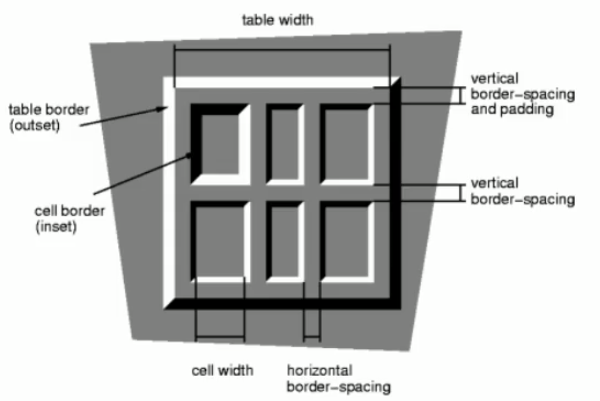

# HTML

Hyper Text Markup Language

超文本标记语言

标记语言

> HTML文档由无数个标记(**标签**、tag)组成
>
> 由标签和内容组成的成为**元素**(element)
>
> img元素、``标签

超文本

>页面内可以包含图片、链接、音乐、视频等非文字元素

## 文档声明

`<!doctype html>`

告诉浏览器文档类型

## 单标签

meta、img、br、input没有包含具体内容，书写格式是单标签 而不是通常的标签对

## 后代元素

元素内嵌套的所有层级的元素都是该元素的后代元素

## 所有元素都有的属性

class、id、title

id在同一个页面中不能有重复

## HTML文件的扩展名

`.htm`或者`.html`

Win95/Win98系统的文件扩展名不能超过3个字符

现在一般都是使用`.html`

## 元素

| 元素 | 描述                         |
| ---- | ---------------------------- |
| sub  | 下标                         |
| sup  | 上标                         |
| h    | 网页的标题，h1~h6，六个等级  |
| p    | 段落，p元素里不能包含div元素 |

### html

W3C标准建议，html元素增加一个lang属性设置语言，en、zh-CN、zh

作用：

* 帮助语音合成工具确定要使用的发音
* 帮助翻译工具确定要使用的翻译规则

### head

head元素里面的内容是一些“元数据”

#### meta

元数据 -> metadata

* 描述数据的数据
* 对网页来进行一些基本设置
  * 指定字符集

H5之前，meta标签的写法比较复杂

```html
<meta http-equiv="Content-Type" content="text/html;charset=UTF-8">
```

H5

```html
<meta charset="utf-8">
```

视口

```html
<meta name="viewport" content="width=device-width, initial-scale=1.0">
```

适配IE，很多都不加

```html
<meta http-equiv="X-UA-Compatible" content="ie=edge">
```

#### link

* 设置网页图标，网页图标支持的图片格式是ico、png，常用大小是16x16、24x24、32x32(px)

  `<link rel="shortcut icon" type="image/x-icon" href="https://static.zhihu.com/static/favicon.ico">`

  可以省略为

  `<link rel="icon" href="https://static.zhihu.com/static/favicon.ico">`

* link元素的rel属性不能省略，用来指定文档与链接资源的关系。

* 一般rel若确定，相应的type也会默认确定，所以可以省略type。

### strong

加粗，用得不多，一般通过css进行加粗

### span/div

通常将div和span作为容器

前端通常要对内容进行归类class，一些内容可以用span来归类

普通的文本是行内元素，span是**行内元素**

span包裹文本，默认情况下没有差别

span用于区分特殊文本和普通文本，比如用来显示一些关键字

### img

width属性，不常用，一般通过css来设置

width和height属性，默认单位是px

HTML5规范中，alt属性是img元素的必须属性，它规定在图像无法显示时的替代文本。

### i

斜体

通常通过font-style来做斜体

约定俗成，i元素通常用来做小图标，因为icon的 i

### a

#### target属性

* _self：自己，默认值，当前页跳转
* _blank：空白，跳转到新的标签页
* `_parent`、`_top`、具体的name，在和iframe一起使用时才有效果

#### iframe中嵌入a元素

* _parent：在该iframe的父页面内打开a
* _top：在iframe内中嵌套iframe，在最顶层中的父页面中打开a
* 具体的name：给iframe设置name属性，在指定的iframe中打开a

**iframe现在用的比较少**

#### a元素和base元素

使用base元素抽取a元素中的公共部分

```html
<base href="https://www.baidu.com" target="_blank">  
a元素公共部分抽取,base元素放在head中
a元素如果有完整的href，则会用自己的
```

#### a元素的锚点

通过点击a元素跳转到页面的某一个位置

在href中设置元素id，**# + id**

```html
<a href="#id"></a>
<a href="index.html/#id"></a>

<a href="#">回到页面顶部</a>
<a href="">回到页面顶部</a>

<body id="top">
    <a href="#top">返回顶部</a>
</body>
```

#### a元素的伪链接

有时候点击链接的时候并不希望打开新的URL，而是希望做点别的，这是可以使用伪链接

伪链接：没有指明具体链接地址的链接

有时候可以把a元素当作按钮来使用

```html
<a href="javascript:void(0)">伪链接1</a>  //也称死链接
<a href="javascript:alert('点击伪链接')">伪链接2</a>
<a href="" onclick="alert('点击伪链接')">伪链接3</a>
```

#### a元素和img元素

```html
<a href="https://www.baidu.com">
  
</a>
```

### 列表

`display:list-item`就是专门给li设计的

#### 有序列表(ol,li)

ordered list   直接子元素只能是li

list item  

#### 无序列表(ul,li)

unordered list   直接子元素只能是li

#### 定义列表(dl、dt、dd)

> definition list   直接子元素只能是dt
>
> definition title/term  列表中每一项的项目名
>
> definition description  列表中每一项的具体描述，是对dt的描述、解释、补充
>
> 一个dt后面紧跟着一个或者多个dd，dt和dd是**兄弟元素**

dt、dd常见的组合：

* 事物名称、事物描述
* 问题、答案
* 类别名、归属于这类的各种事物

### 表格

> table是块级元素
>
> 以前有用表格来做布局，现在很少这样做了
>
> **样式和结构**分离，设置样式的属性通常不使用

* tr     table row     表格中的行
* td    table description/define    行中的单元格

细边框表格，**将边框合并**，常用，重要

```css
table{
    border-collapse:collapse;      默认是separate
}
td{
    border: 1px solid #000;       设置单元格的边框
}
```

表格水平居中

```css
margin:0 auto;
```

#### 其他表格元素

##### tbody

表格的内容，表格的主体

##### caption

表格的标题

##### thead

表格的头部，表的第一行，标题行

thead -> tr -> th

##### tfoot

表格的页脚，很少用

#### 单元格的合并

合并要领：合并的方向是向右和向下，并删除被占的响应单元格

跨列 ，向右合并，td元素的colspan属性

```html
<td colspan="2"></td>    跨2列合并
```

跨行，向下合并，td元素的rowspan属性

```html
<td rowspan="2"></td>    跨2行合并
```

#### border-spacing

设置单元格之间的水平、垂直间距，比如

```css
table {
    border-spacing:10px 20px
}
```

两个值分别是cell之间的水平、垂直间距

如果只设置一个值，同时代表水平、垂直间距



### 表单


### 不常用元素

| 元素 | 描述                    |
| ---- | ----------------------- |
| br   | 一般通过块级元素div换行 |
| pre  | 可以保留多个空格        |

#### code

```css
等同
span{
  font-family:monospace
}
```

#### hr

很少用hr来做分割线

```css
div {
  height:10px;
  background-color:red;
}

通过border来做分割线
```

## SEO

Search Engin Optimization，搜索引擎优化

> 百度、搜狗、360、google等
>
> 搜索引擎通过爬虫，爬取大量网站数据放入数据库供搜索
>
> 后端渲染的网页在百度中SEO比较好，前端渲染不行
>
> google前端渲染和后端渲染的SEO都好

### h元素和SEO优化

h元素有助于网站的SEO，可以促进关键词排名

h1元素权重比较重，搜索引擎优先匹配h1元素。

建议在网页中最多只有1个h1元素

乱用h元素不仅不会给网站带来好的权重，同时也会有可能被搜索引擎认为作弊，最后导致K站

示例：京东h1

## URL

```
protocol://hostname[:port]/path/[;parameters][?query]#fragment

[;parameters]基本上很少用了
#fragment   锚点，定位到锚点的位置
```

## 字符实体

两种书写格式，实体名称和实体编号


### 缩进

一般不用`&nbsp;`来实现缩进
一般通过css来实现缩进

```css
.p2{
  text-indent:2em
}
```

## 常用图片格式

* web中常用的图片格式有
  * png：静态图片，支持透明
  * jpg/jpeg：静态图片，不支持透明
  * gif：动态图片、静态图片，支持透明
  * webp：google2010年推出的一个图片格式，在保证和jpeg相同质量的同时，传输更快

## 标签语义化

选择标签的时候要尽量让每一个标签都有正确的语义

虽然很多标签之间呼唤之后也能实现功能，但是还是尽量要遵守标签语义化的原则

使用最合适的标签去做最合适的事情

好处：

* 方便代码维护
* 减少开发者之间的沟通成本
* 能让语音合成工具正确识别网页元素的用途，以便做出正确的反应
* 让搜索引擎能够识别重要的信息

## 块级元素和内联元素

### 块级元素


### 内联元素(行内元素)

## 行内块状元素


## 替换元素和非替换元素

替换元素：浏览器并不直接显示其内容，而是通过其某个属性的值来显示具体的内容

非替换元素：浏览器直接显示元素所包含的内容

## 规范

## 备注

* 很少使用br元素来换行
* 浏览器对标签不区分大小写
* 所有的网页目前都需要采用UTF-8编码
* p元素中不建议使用div
* div的内容本质上的高度是line-height而不是height
* 路径中的`\`仅仅在window支持，window也支持`/`
* style标签一般不写在body中
* i元素通常用来做小图标

