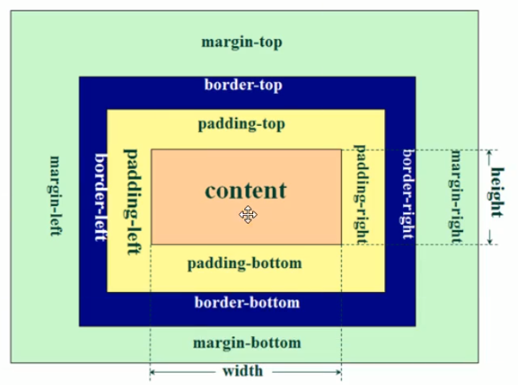
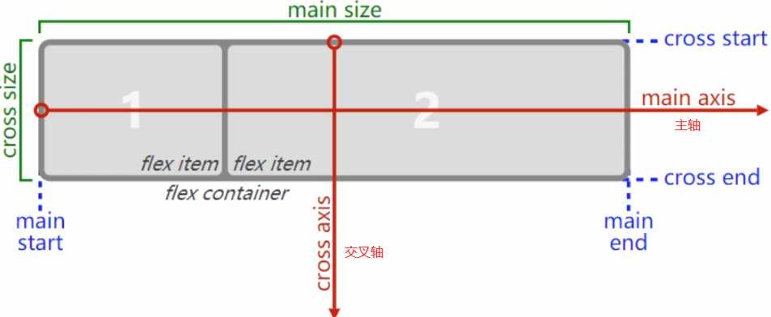

# CSS

CSS（Cascading Style Sheets，层叠样式表）是用来控制网页在浏览器中的显示外观的声明式语言。

最大的优势是层叠，意为多个选择符之间具有特定的优先级。

## 推荐网站

[官方文档](https://www.w3.org)

[MDN](https://developer.mozilla.org/zh-CN/)

[CSS属性的可用性](https://caniuse.com)

## 名词解释

### 层叠

当应用两条同级别(相同权重)的规则到一个元素的时候，写在后面的就是实际使用的规则。

### 继承

在默认情况下，一些css属性继承当前元素的父元素上设置的值，有些则不继承。

哪些属性属于默认继承很大程度上是由常识决定的。

#### 控制继承

CSS 为控制继承提供了四个特殊的通用属性值。每个css属性都接收这些值。

* `inherit`，设置该属性会使子元素属性和父元素相同。实际上，就是 "开启继承".
* `initial`，设置属性值和浏览器默认样式相同。如果浏览器默认样式中未设置且该属性是自然继承的，那么会设置为 `inherit` 。
* `unset`，将属性重置为自然值，也就是如果属性是自然继承那么就是 `inherit`，否则和 `initial`一样
* revert，只有很少的浏览器支持。

#### 重设所有属性

all属性是所有属性的速记属性。

CSS 的 shorthand 属性 `all` 可以用于同时将这些继承值中的一个应用于（几乎）所有属性。它的值可以是其中任意一个(`inherit`, `initial`, `unset`, or `revert`)。这是一种撤销对样式所做更改的简便方法，以便回到之前已知的起点。

### 优先级

浏览器是根据优先级来决定当多个规则有不同选择器对应相同的元素的时候需要使用哪个规则。

- 一个元素选择器不是很具体 — 会选择页面上该类型的所有元素 — 所以它的分数就会低一些。
- 一个类选择器稍微具体点 — 它会选择该页面中有特定 `class` 属性值的元素 — 所以它的分数就要高一点。

#### 优先级的计算

1. **千位**： 如果声明在 `style` 的属性（内联样式）则该位得一分。这样的声明没有选择器，所以它得分总是1000。
2. **百位**： 选择器中包含ID选择器则该位得一分。
3. **十位**： 选择器中包含类选择器、属性选择器或者伪类则该位得一分。
4. **个位**：选择器中包含元素、伪元素选择器则该位得一分。

**注**: 通用选择器 (`*`)，组合符 (`+`, `>`, `~`, ' ')，和否定伪类 (`:not`) 不会影响优先级。

**警告:** 在进行计算时不允许进行进位

数值越大优先级越高。

#### `!important`

覆盖所有上面所有优先级计算。

用于修改特定属性的值， 能够覆盖普通规则的层叠。

覆盖 `!important` 唯一的办法就是另一个 `!important` 具有 相同*优先级* 而且顺序靠后，或者更高优先级。

**强烈建议除了非常情况不要使用它**

`!important` 改变了层叠的常规工作方式，它会使调试 CSS 问题非常困难，特别是在大型样式表中

## CSS的作用

可以给网页的每一个元素 **设置样式**，可以对元素进行 **布局**，让网页更加精美。

浏览器会根据 CSS 的样式定义将其选定的元素显示为恰当的形式。

## CSS工作原理

### 浏览器加载网页的基本步骤

* 加载HTML文件
* 将HTML文件转化为DOM（Document Object Model），DOM是文件在计算机内存中的表现形式
* 浏览器拉取该HTML相关的大部分资源
* 浏览器拉取到CSS之后会进行解析、渲染树(将css规则应用到对应的DOM节点)
* 渲染树依照应该出现的结构进行布局
* 网页展示在屏幕上（这一步被称为着色）


## 三种添加CSS的方式

### 外部样式表  (最为推荐)

> 外部.css文件
>
> `<link>`

### 内部样式表

> `<head>`中使用`<style>`标签

### 内联样式(行内样式)

>在html元素中添加style属性
>
>最好不要使用这种方式，除非要动态改变样式可以考虑。
>
>难以维护

## [CSS选择器](https://www.runoob.com/cssref/css-selectors.html)

> 每个CSS规则都以一个选择器或一组选择器为开始，去告诉浏览器这些规则应该应用到哪些元素上。

### 专一性

通常情况下，两个选择器可以选择相同的HTML元素。

级联规则和专用规则，用来控制在发生碰撞时哪条规则将获胜。

#### 级联规则

> 对于同类选择器，稍后的样式将覆盖以前的样式

#### 专用规则

> 类选择器和元素选择器选中相同元素，类将获胜，无论前后。
>
> 一个类被描述为比元素选择器更具体，或者具有更多的特异性，所以它获胜了。

### 选择器的类型

#### class选择器

```
.paragraph {
     color:red;
}
```

##### 针对类的特定元素

```
h1.highlight {

}
```

##### 针对类的特定类

```
选择同时具有notebox和warning两个类的元素
.notebox.warning {
    border: 4px solid orange;
    font-weight: bold;
}
```

#### id选择器

> 唯一
>
> ID具有很高的特异性，并且会推翻大多数其他选择器
>
> 在大多数情况下，最好是在元素中添加一个类而不是使用ID

```
#para1 {
     color:red;
}
```

#### 元素选择器

```
p {
     color:red;
}
```

#### 属性选择器

根据元素上某个属性的存在来选择元素

```
根据a元素的title属性是否存在来选择元素
a[title] {

}
```

根据具有特定值的属性的存在来选择元素

```
a[href="https://example.com"] {

}
```

#### 伪类选择器

> 为元素的某些状态设置样式

```
a:hover {

}
```

##### `:hover`

> 鼠标移到元素上面时添加的样式

##### `:active`

> 向活动的元素添加样式
>
> 当点击元素时，元素变成活动的

##### `:visited`

> 向访问过的链接添加特殊的样式。

#### 伪元素选择器

> 选择元素的某个部分而不是元素本身

#### ::first-line

> 始终选择元素内的文本的第一行

```
p::first-line { }
```

#### :: before和:: after

> 与`content`属性一起使用，来通过CSS将内容插入文档中

#### 组合选择器

```
当选择器列表中有无效选择器，整个规则将被浏览器忽视
h1, ..special { 
  color: blue; 
} 
```

##### 选择器嵌套

```
.login {
  .logo {
  
  }
}

相当于
.login {

}
.login.logo {

}
选择class是login的元素内所有class是logo的元素
```

#### 通用选择器

> *匹配所有元素

```
* {
  color: green;
}
```

## 函数

> 虽然大多数值是相对简单的关键字或数值，但也有一些可能的值以函数的形式出现。

### `calc()`函数

> 这个函数允许您在CSS中进行简单的计算
>
> calculate的缩写，CSS3新增，为元素指定动态宽度、长度等，注意此处的动态是计算之后得一个值

```
width: calc(90% - 30px);
```

## 属性

| 属性            | 描述                                                         |
| --------------- | ------------------------------------------------------------ |
| transform       | 属性允许你旋转，缩放，倾斜或平移给定元素。这是通过修改CSS视觉格式化模型的坐标空间来实现的。 |
| letter-space    | 字母间距                                                     |
| word-space      | 词间距                                                       |
| line-height     | 行高                                                         |
| text-decoration | 设置文本的修饰线外观，下划线、删除线等                       |

### 速记属性(ShortHands)

> 一些属性，如 `font`, `background`, `padding`, `border`, and `margin`等属性称为速记属性--这是因为它们允许您在一行中设置多个属性值，从而节省时间并使代码更整洁。

**警告：**虽然速记经常允许您忽略值，但它们会将**不包含**的任何值重置为它们的**初始值**。这确保使用了一组合理的值。但是，如果您期望速记只更改传入的值，这可能会使您感到困惑。

### 空格

> 在CSS中，属性、属性值中的空格需要小心。

## @规则

> 规则名和值

### @import

>将额外的样式表导入主CSS样式表

```
@import 'styles2.css';
```

### @media

> 允许您使用 媒体查询 来应用CSS，仅当某些条件成立(例如，当屏幕分辨率高于某一数量，或屏幕宽度大于某一宽度时)。

```
body {
  background-color: pink;
}

@media (min-width: 30em) {
  body {
    background-color: blue;
  }
}
使用@media创建样式表的一个部分，该部分仅适用于视口大于30em的浏览器。如果浏览器的宽度大于30em，则背景色将为蓝色。
```

## CSS里的颜色

* 关键词：`black`
* 十六进制：`#ff0000`
* rgb函数：`rgb(255,0,0)`
* rgba函数：`rgb(255,0,0,0.5)`
* HSL：`hsl(0,100%,50%)`  色相hue，饱和度saturation，亮度lightness
* HSLA：`hsl(0,100%,50%,0.5)`

[颜色转换工具](https://serennu.com/colour/hsltorgb.php)

### HSL函数


### rgba函数

```
rgba(255, 255, 255, 0.2)
```

前三个值（红绿蓝）的范围为0到255之间的整数或者0%到100%之间的百分数。这些值描述了红绿蓝三原色在预期色彩中的量。
第四个值，alpha值，制订了色彩的透明度/不透明度，它的范围为0.0到1.0之间，0.5为半透明。

**background-color设置为透明的方法**

```
background-color:transparent;
或者
background-color: rgba(255,255,255,0.2);
```

## CSS中的字体

font-family

> 指定字体
>
> 可以指定多个字体，但是前面的优先
>
> 有空格的字体名要加引号
>
> serif有衬线，sans-serif无衬线，花体和非花体
>
> monospace，字体等宽

[字体在各平台的占有率情况](https://www.cssfontstack.com)

[字体选用](https://fonts.google.com)

[字谈字畅](https://www.thetype.com)

font-size一般默认是16px

font-weight字体粗细

可以将字体的所有设置放在font里面

```
font-family: XXX;
font-size:16px;
font-weight:normal;
等同：
font:normal 16px XXX;
```

## 盒子模型




HTML中的每一个元素都可以看作是一个盒子

```
background-color:只改变cotent的背景颜色
```

### 外边距塌陷/外边距重叠

两个盒子靠在一起，取最大的margin作为外边距

```
margin:5px 10px 5px 10px
上右下左  顺时针

margin:5px 10px
上上下下

margin:5px
所有

margin:5px 10px 5px
上边距    左右边距    下边距
```

### 边框

```
border-style:dotted solid double dashed; 
```

- 上边框是点状
- 右边框是实线
- 下边框是双线
- 左边框是虚线

```
border-radius:20px   边框的圆润程度
```

## 相对长度单位

[px、em、rem区别介绍](https://www.runoob.com/w3cnote/px-em-rem-different.html)

### px

> px像素（Pixel）。相对长度单位。像素px是相对于显示器屏幕分辨率而言的。

- IE无法调整那些使用px作为单位的字体大小；
- 国外的大部分网站能够调整的原因在于其使用了em或rem作为字体单位；
- Firefox能够调整px和em，rem，但是96%以上的中国网民使用IE浏览器(或内核)。

### em

> em是相对长度单位。相对于当前对象内文本的字体尺寸。如当前对行内文本的字体尺寸未被人为设置，则相对于浏览器的默认字体尺寸。
>
> 任意浏览器的默认字体高都是16px。
>
> 所有未经调整的浏览器都符合: 1em=16px。

- em的值并不是固定的；
- em会继承父级元素的字体大小。

### rem

> CSS3新增的一个相对单位。
>
> 用rem为元素设定字体大小时，仍然是相对大小，但相对的只是HTML根元素。这个单位可谓集相对大小和绝对大小的优点于一。
>
> 通过它既可以做到只修改根元素就成比例地调整所有字体大小，又可以避免字体大小逐层复合的连锁反应。

### 选择

对于只需要适配少部分手机设备，且分辨率对页面影响不大的，使用px即可 。

对于需要适配各种移动设备，使用rem，例如只需要适配iPhone和iPad等分辨率差别比较挺大的设备。

## 标准流(Normal Flow)

也叫常规流、正常流、文档流

从左到右、从上到下顺序排列

默认情况下，互相不存在层叠现象


## 定位(脱标)

使用margin和padding进行定位会影响其他元素，而且不好实现层叠。

三种对元素进行定位和布局的方法

- 标准流
- 定位：position
- float：浮动

### position

> 指定一个元素（静态的，相对的，绝对或固定）的定位方法的类型。

- static：静态定位，默认值，就是标准流
- relative：相对定位，相对于其正常位置进行定位。
- absolute：绝对定位，逐级往父元素找，直到这个父元素为**非static**的，就相对于这个元素进行定位，一直找到浏览器视口。
- fixed：固定定位，相对浏览器视口
- sticky：

常用到的值：left、right、top、bottom，在static中没作用

### 脱标元素

position:fixed/absolute,float

### 脱标元素的特点

- 可以随意设置高度和宽度
- 宽高默认由内容决定
- 不再受标准流约束
- 不再向父元素汇报宽高数据

### 脱标元素和display有什么关系？

https://www.w3.org/TR/CSS2/visuren.html#dis-pos-flo

## float

> 定义元素在哪个方向浮动。会使元素向左或向右移动，直到自己的边界紧贴着包含块（一般是父元素）或者其他浮动元素的边界为止，其周围的元素也会重新排列。
>
> 相对于flex兼容性更好

- none   默认值，元素不浮动
- left   元素向左浮动
- right   元素向右浮动
- inherit   从父元素继承float属性

### 清除浮动

#### 为什么要清除浮动？

> 浮动本质是用来做文字混排效果的，但是拿来做布局用，则会有很多的问题出现。
>
> 浮动元素不再占用原文档流的位置，所以它会对后面的元素排版产生影响。
>
> 清除浮动，是清除浮动后造成的影响。
>
> 解决父级元素因为子级浮动引起内部高度为 0 的问题。

#### 解决方法

1.父元素内尾部添加元素clear

```
html:
<div class="clear"></div>

<style>
.clear{
 clear: both;
}
</style>
```

2.父盒子使用伪类after清除float

```
.box:after {
    display: block;
    visibility: hidden;
    clear: both;
    content: "";
}
.box{
    zoom:1;/*解决兼容问题*/
}
```


## flex布局

> (Flexible)弹性布局，比浮动布局简单
>
> flex布局是目前web开发中使用最多的布局方案，特别是移动端

开启flex布局的元素叫做flex-container。

flex-container里面的直接子元素叫做flex items

开启flex布局：

`display:flex`



### 应用在flex container上的属性

#### flex-direction

> 决定主轴的方向

- row：默认，从左到右
- row-reverse：从右到左
- column：从上到下
- column-reverse：从下到上

#### justify-content

> 决定了flex items在主轴上的对齐方式

- flex-start，默认值，与main start对齐
- flex-end，与main end对齐
- center，居中对齐
- space-between
- space-evenly
- space-around

#### align-items

> 决定了flex items在交叉轴上的对齐方式

- normal，默认，当flex items在交叉轴方向上的size为auto时，自动拉伸到填充flex container
- stretch，同normal。

### 应用在flex items上的属性

## display

> display 属性规定元素应该生成的框的类型。

- none   此元素不会被显示
- inline   默认。此元素会被显示为内联元素，元素前后没有换行符。

## z-index

> 设置元素的堆叠顺序。拥有更高堆叠顺序的元素总是会处于堆叠顺序较低的元素的前面。
>
> 元素可拥有负的 z-index 属性值。
>
> Z-index 仅能在定位元素上奏效（例如 position:absolute;）！
>
> 首先，默认，auto。堆叠顺序与父元素相等。如果父元素没有指定，z-index默认为0。

## 实现分割线

```
border-bottom: 1px solid $color-gray;
```

## 备注

### 当浏览器遇到无法解析的CSS代码会发生什么？

浏览器什么也不会做，继续解析下一个CSS样式。

### lorem

> lorem生成随机字符，写乱了的拉丁语,是网页设计中,排版用的假文字,没有什么实际含义
>
> lorem100   随机生成100个字符