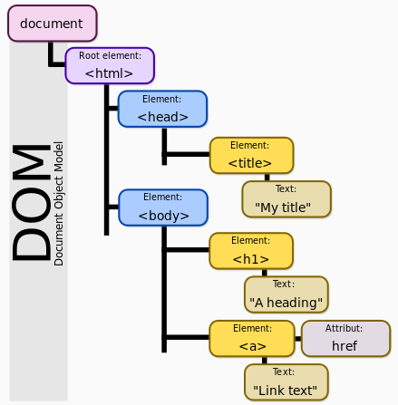

# JavaScript

## 了解JavaScript

函数优先，函数第一公民。解释型语言，基于原型

，多范式，动态脚本语言。

### 编程范式

指面向过程、面向对象、函数式、泛型编程等。

泛型为程语言提供了更高层级的抽象，即参数化类型。

### 静态语言

强类型语言，强制数据类型

在编译时变量的数据类型即可确定的语言，要求在使用变量之前必须声明数据类型

### 动态语言

弱类型语言，与强类相反，数据类型可以被忽略。

在运行时确定数据类型的语言，变量使用之前不需要类型声明，通常变量的类型是被赋值的那个值的类型。 

## 继承与原型链

JavaScript在ES6中引入`class`关键字，但这知识**语法糖**，JavaScript仍然是基于原型的。


## `Object.defineProperty()`

> 在一个对象上定义一个新属性，或者修改一个已经存在的属性，并返回这个对象

### 语法

> `Object.defineProperty(obj, prop, descriptor)`

### 参数

- obj   需要定义属性的对象
- prop   需被定义或修改的属性名
- descriptor   需被定义或修改的属性描述符

默认情况下，使用 `Object.defineProperty()` 增加的属性值是不可改变的。

#### 属性描述符

两种形式：

- 数据描述符：一个拥有可写或不可写值的属性
- 存取描述符：由一对 getter-setter 函数功能来描述的属性

描述符必须是两种形式之一；不能同时是两者。

**数据描述符和存取描述符均具有以下可选键值：**

- `configurable`: 仅当该属性的 configurable 为 `true` 时，该属性才能够被改变，也能够被删除。默认为 `false`
- `enumerable`: 仅当该属性的 enumerable 为 `true` 时，该属性才能够出现在对象的枚举属性中。默认为 `false`
- `value`: 该属性对应的值。可以是任何有效的 JavaScript 值（数值，对象，函数等）。默认为 `undefined`
- `writable`: 仅当仅当该属性的writable为 `true` 时，该属性才能被赋值运算符改变。默认为 `false`
- `get`: 一个给属性提供 getter 的方法，如果没有 getter 则为 `undefined`。该方法返回值被用作属性值。`undefined`
- `set`: 一个给属性提供 setter 的方法，如果没有 setter 则为 `undefined`。该方法将接受唯一参数，并将该参数的新值分配给该属性。默认为`undefined`。

## this的赋值

this在对象调用的时候指代的对象会变，所以使用的时候最好是先赋值给一个变量，保证使用this的时候还是你想要使用的那个对象

## 箭头函数的this和普通函数function的this

箭头函数没有自己的this值，它的this是从里往外找，直到找到this的定义。

- 普通函数：根据调用我的人（谁调用我，我的this就指向谁）
- 箭头函数：根据所在的环境（我在哪个环境中，this就指向谁）

**普通函数中的this:**

1. this总是代表它的直接调用者
2. 在默认情况(非严格模式下,未使用 'use strict'),没找到直接调用者,则this指的是 window
3. 在严格模式下,没有直接调用者的函数中的this是 undefined
4. 使用call,apply,bind(ES5新增)绑定的,this指的是 绑定的对象

**箭头函数中的this：**

1. 箭头函数没有自己的this, 它的this是继承而来;
2. 默认指向在定义它时所处的对象(宿主对象),而不是执行时的对象

**作用域链：**

当在函数中使用一个变量的时候,首先在本函数内部查找该变量,如果找不到则找其父级函数,最后直到window,全局变量默认挂载在window对象下

## localStorage

- localStorage 和 sessionStorage 属性允许在浏览器中存储 key/value 对的数据。
- localStorage 用于长久保存整个网站的数据，保存的数据没有过期时间，直到手动去删除。
- sessionStorage 在关闭窗口或标签页之后将会删除这些数据。
- localStorage 属性是 **只读** 的。
- 相当于一个 5M 大小的针对于前端页面的数据库。
- 相比于 cookie 可以节约带宽。
- 只有在高版本的浏览器中才支持的。
- localStorage 的使用也是遵循同源策略的，所以不同的网站直接是不能共用相同的 localStorage。

### 局限

- 浏览器的大小不统一，并且在 IE8 以上的 IE 版本才支持 localStorage 这个属性。
- 目前所有的浏览器中都会把localStorage的值类型限定为 **string** 类型
- localStorage在浏览器的隐私模式下面是不可读取的。
- localStorage不能被爬虫抓取到。
- localStorage本质上是对字符串的读取，如果存储内容多的话会消耗内存空间，会导致页面变卡。

### 使用

```js
localStorage.setItem('myCat', 'Tom');
let cat = localStorage.getItem('myCat');
localStorage.removeItem('myCat');
localStorage.clear();
```

## JavaScript对象

JavaScript 中的所有事物都是对象。

对象只是带有属性和方法的特殊数据类型。

### 创建对象

```
//方式一
person=new Object();
//添加属性
person.firstname="John";
person.age=50;

//方式二
person={firstname:"John",age:50};

//方式三
//使用对象构造器
function person(firstname,age)
{
    this.firstname=firstname;
    this.age=age;
}
worker=new person("John",50);

//方式四
//基于现有对象创建新的对象
var person2 = Object.create(person1);
```

## JavaScript 类

> class 声明创建一个基于原型继承的具有给定名称的新类

- 类声明不允许再次声明已经存在的类，否则将会抛出一个类型错误。
- 类声明不可以提升
- 类声明体在严格模式下运行

使用示例

```
class Polygon {
  constructor(height, width) {
    this.name = 'Polygon';
    this.height = height;
    this.width = width;
  }
}

class Square extends Polygon {
  constructor(length) {
    super(length, length);
    this.name = 'Square';
  }
}
```

## 变量的作用域，全局变量

JavaScript中函数有作用域，let有块级作用域。

除此之外声明的变量就是全局变量，全局变量是window的属性。

可以使用`window.XXX`进行访问，也可以省略`window.`直接进行访问

## script标签

script标签可以简单地理解为文本替换

## JavaScript"=="和"==="的区别

"==="表示恒等，首先比较两边的变量数据类型是否相等，其次比较两边的变量的数值是否相等；
"=="表示相等即仅仅比较两边变量的数值是否相等。

## JavaScript在head和body中的区别

在head中：被调用才执行。

在body中：页面加载时被执行，通常被用来生成页面的内容。

## 方法与函数的区别

- 方法：method
- 函数：function

方法通常和某个类或实例挂钩。

Java里面只有方法，没有函数，但后面引入了函数式接口。因为不能脱离类。

JavaScript里面既有方法也有函数。

## 闭包

叹号后面跟函数!function
和加号后面跟函数+function
都是跟`(function(){})();`这个函数是一个意思，都是告诉浏览器**自动运行**这个匿名函数的，因为!+()这些符号的运算符是最高的，所以会先运行它们后面的函数

## JS字节码

JS类似Java中间也会生成字节码,再交给浏览器

V8引擎可以直接将JS转成二进制代码，所以效率更高，V8NB。

## JavaScript中的&&和||

在javascript中以下内容会被当成false处理：

**"" , false , 0 , null , undefined , NaN**

注意：字符串"false"也会被当做true处理

**注意：在js中&&运算符优先级大于||**

### 两个对象的运算

**当运算到某一个变量就得出最终结果之后，就返回哪个变量。**

**a || b：**

如果a是true，那么b不管是true还是false，都返回true。因此不用判断b了，这个时候刚好判断到a，因此返回a。

如果a是false，那么就要判断b。如果b是true，那么返回true，如果b是false，返回false。其实运算到b得出结果，不就是返回b了吗。

**a && b：**

如果a是false，那么b不管是true还是false，都返回false，因此不用判断b了，这个时候刚好判断到a，因此返回a。

如果a是true，那么就要在判断b，和刚刚一样，**不管b是true是false**，都返回b。

## 变量的隐式声明

隐式变量都是指没有用var，let，const等关键字定义的变量

JavaScript变量可以不用声明(var，let，const等关键字)，直接赋值，此时就是隐式声明

```
a = "lizhanxu"
console.log(a)
```

### 隐式变量和var变量的区别

在函数内，隐式变量是全局变量，var变量是局部变量

隐式声明的全局变量可delete，var声明的全局变量无法delete

## `console.log()` 重写

```
var log = console.log.bind(console);
```

## jQuery的extend方法

```
$.extend(true, curruser, curruser["ipInfo"]);
```

* 第一个参数，true：深拷贝，false：浅拷贝
* 第二个参数，target
* 之后的参数可以是一个或多个，被拷贝的对象

## 对象属性的访问方式

```
person.firstname
等同
person["firstname"]
```

## Node和Element对象的区别

Node是被各种DOM API继承的接口。

Element、Text(文本)、Comment(注释)都是继承于Node，分别叫做ELEMENT_NODE,TEXT_NODE,COMMENT_NODE。

平常使用的html上的元素，即Element是类型为ELEMENT_NODE的Node。

[Node.nodeType](https://developer.mozilla.org/zh-CN/docs/Web/API/Node/nodeType)返回一个整数，表示该节点的类型。

