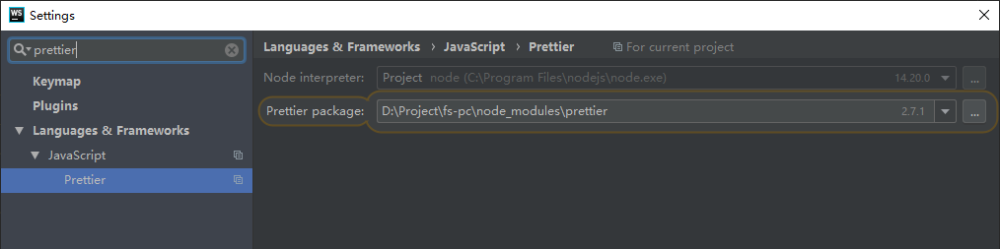
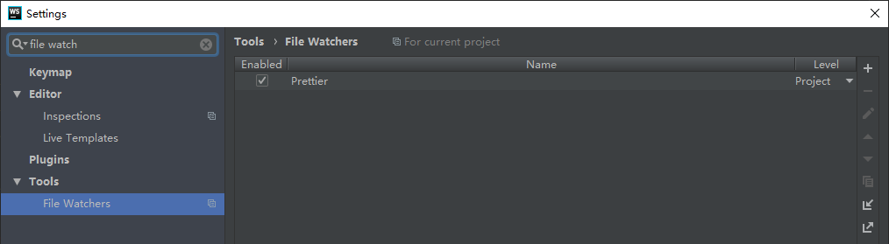
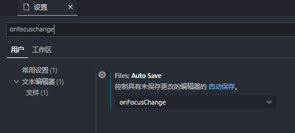
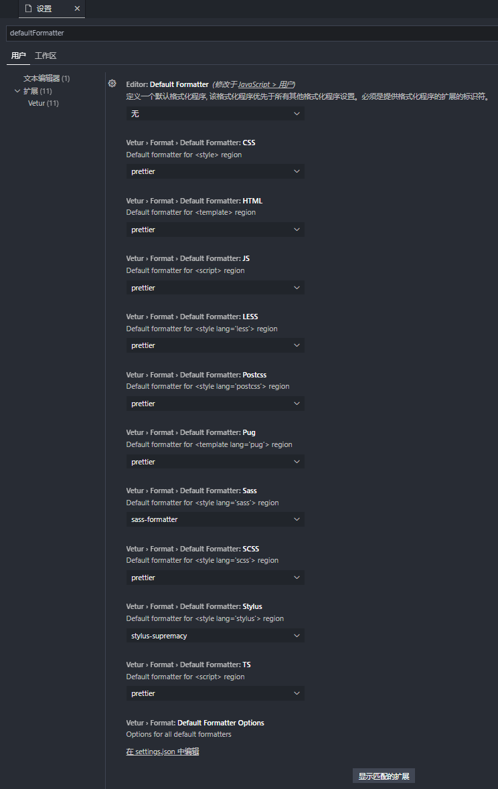
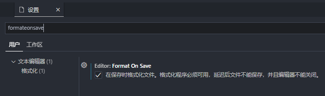
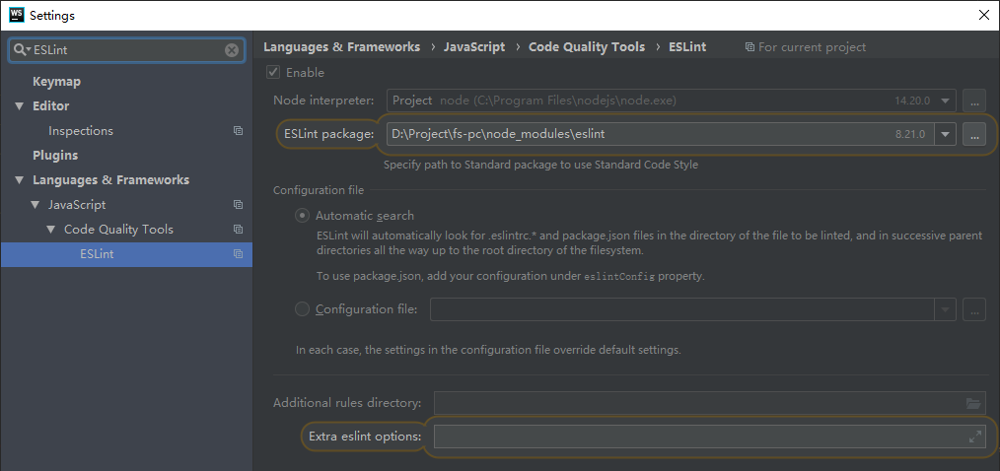
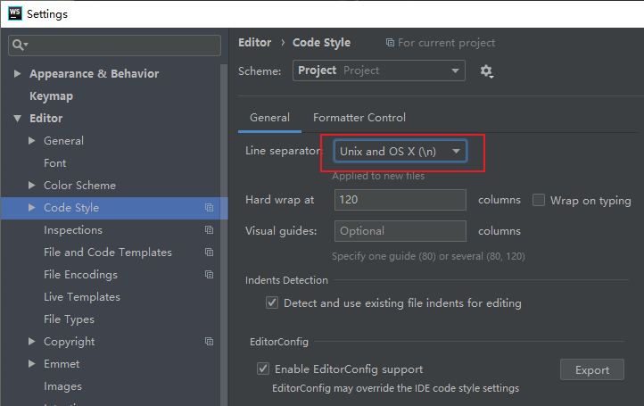
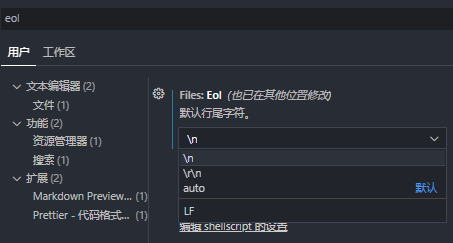

# 统一代码风格

## `.editorconfig`

```
root = true

[*]
charset = utf-8
indent_style = space
indent_size = 2
end_of_line = lf
insert_final_newline = true
trim_trailing_whitespace = true
```

## Prettier

> 代码格式化工具
>
> 确保所有输出的代码符合一致的样式
>
> 拥有共同的风格指南对项目和团队很有价值
>
> 使用Prettier进行格式化，使用lint来捕获错误

### 安装

```
npm install --save-dev --save-exact prettier
```

### 配置文件

#### [参数说明](https://prettier.io/docs/en/options.html)


| 配置项        | 接收值             | 默认值           | 说明                               |
| ------------- | ------------------ | ---------------- | ---------------------------------- |
| semi          | Boolean            | true             | 是否需要在句尾添加分号             |
| printWidth    | Int                | 80               | 每行的长度，超出自动换行           |
| tabWidth      | Int                | 2                | 缩进空格数                         |
| useTabs       | Boolean            | false            | 是否使用制表符缩进                 |
| singleQuote   | Boolean            | false            | 使用单引号代替双引号               |
| arrowParens   | "always","avoid"   | "always(V2.0.0)" | 箭头函数单个参数时是否要需要小括号 |
| trailingComma | "es5","none","all" | "es5(V2.0.0)"    | 对象最后一项是否加上逗号           |

#### 示例`.prettierrc`

```
{
  "semi": false,
  "printWidth": 120,
  "tabWidth": 2,
  "singleQuote": true,
  "arrowParens": "avoid",
  "trailingComma": "none",
  "quoteProps": "preserve"
}
```

### 忽略文件或目录

> 根目录创建`.prettierignore`

### 命令行

```
prettier --write .   格式化所有文件

prettier --check .   检查文件是否格式化
```

### 与ESLint集成

> 安装`eslint-config-prettier`   `eslint-plugin-prettier`
>
> ESLint配置文件的extends中prettier放在末尾来解决 eslint 和 prettier 的冲突

### [WebStorm设置](https://www.prettier.cn/docs/webstorm.html)





### VSCode设置

#### 安装Prettier插件

#### 设置自动保存



#### 设置默认格式化工具



#### 设置文件保存时格式化



### Git钩子（非必要）

> 在提交前运行prettier

#### 常用钩子

##### 提交的代码规范

- **pre-commit**
- 描述: 通过钩子函数,判断提交的代码是否符合规范

##### 提交的信息规范

- **commit-msg**
- 描述: 通过钩子函数,判断 commit 信息是否符合规范

##### 提交的代码影响

- **pre-push**
- 描述: 通过钩子,执行测试,避免对以前的内容造成影响

#### 工具

- **husky**

  - 操作 git 钩子的工具

- **lint-staged**

  - 本地暂存代码检查工具

- **commitlint**

  - commit 信息校验工具

- **commitizen**

  * 辅助 commit 信息 ,就像这样,通过选择输入,规范提交信息

    * feat: 表示新增了一个功能

      fix: 表示修复了一个 bug

      docs: 表示只修改了文档

      style: 表示修改格式、书写错误、空格等不影响代码逻辑的操作

      refactor: 表示修改的代码不是新增功能也不是修改 bug，比如代码重构

      perf: 表示修改了提升性能的代码

      test: 表示修改了测试代码

      build: 表示修改了编译配置文件

      chore: 无 src 或 test 的操作

      revert: 回滚操作

  * 对应的idea插件  git commit template

  * 对应的vscode插件  git-commit-plugin

  * npm 全局安装

- **cz-conventional-changelog**

  * 当commit message被commitizen规范后，可以通过该工具生成changelog
  * npm 全局安装

## ESLint

> 开源的JavaScript代码检查工具。
>
> 代码检查是一种静态的分析，常用于寻找有问题的模式或者代码，并且不依赖于具体的编码风格。
>
> 对大多数编程语言来说都会有代码检查，一般来说编译程序会内置检查工具。
>
> JavaScript 是一个动态的弱类型语言，在开发中比较容易出错。
>
> 插件化，可拔插的

### 安装

```
npm install eslint --save-dev

npx eslint --init   快速创建配置文件

devDependencies:
"eslint": "^8.21.0",
"eslint-config-prettier": "^8.5.0",
"eslint-config-standard": "^17.0.0",
"eslint-plugin-import": "^2.26.0",
"eslint-plugin-n": "^15.2.4",
"eslint-plugin-prettier": "^4.2.1",
"eslint-plugin-promise": "^6.0.0",
"eslint-plugin-vue": "^9.3.0",
```

### [命令行](https://eslint.bootcss.com/docs/user-guide/command-line-interface)

```
eslint [options] [file|dir|glob]*
```

#### [options](https://eslint.bootcss.com/docs/user-guide/command-line-interface#options)

```
eslint -h   查看所有options
```

| 选项                 | 说明                                                         |
| -------------------- | ------------------------------------------------------------ |
| `-fix`               | Automatically fix problems                                   |
| `--max-warnings Int` | Number of warnings to trigger nonzero exit code - default: -1 |
| `--init`             | Run config initialization wizard - default: false            |
| `--ext [String]`     | Specify JavaScript file extensions - default: .js            |

#### [退出码](https://eslint.bootcss.com/docs/user-guide/command-line-interface#exit-codes)

- `0`: 检测成功，没有错误。如果 `--max-warnings` 标志被设置为 `n`，那么警告数量最多为`n`。
- `1`: 检测成功，并且至少有一个错误，或者警告多于 `--max-warnings` 选项所允许的警告。
- `2`: 由于配置问题或内部错误，检测未能成功。

#### 示例

```
eslint . --ext .vue,.js,.ts,.jsx,.tsx --max-warnings 0
```

### [配置](https://eslint.bootcss.com/docs/user-guide/configuring)

#### 配置方式

* 使用 JavaScript 注释把配置信息直接嵌入到一个代码源文件中
* 配置文件

#### 配置信息

##### [**Environments**](https://eslint.bootcss.com/docs/user-guide/configuring#specifying-environments)（运行环境）

> 指定脚本的运行环境。每种环境都有一组特定的预定义全局变量。

##### [**Globals**](https://eslint.bootcss.com/docs/user-guide/configuring#specifying-globals)（全局变量）

> 脚本在执行期间访问的额外的全局变量。

```
{
    "globals": {
        "var1": "writable",   //可写
        "var2": "readonly",   //只读
        "Promise": "off"      //禁用
    }
}
```

##### **Rules**

> 启用的规则及其各自的错误级别。

#### 配置文件

[配置文件类型](https://eslint.bootcss.com/docs/user-guide/configuring#configuration-file-formats)

- **(弃用)** - 使用 `.eslintrc`。

##### [parser](https://eslint.bootcss.com/docs/user-guide/configuring#specifying-parser)

> ESLint 默认使用[Espree](https://github.com/eslint/espree)作为其解析器，你可以在配置文件中指定一个不同的解析器

##### [parserOptions](https://eslint.bootcss.com/docs/user-guide/configuring#specifying-parser-options)

> 指定想要支持的 JavaScript 语言选项

##### [plugins](https://eslint.bootcss.com/docs/user-guide/configuring#configuring-plugins)

> ESLint 支持使用第三方插件。在使用插件之前，你必须使用 npm 安装它。

##### [extends](https://eslint.bootcss.com/docs/user-guide/configuring#extending-configuration-files)

> 集成配置文件

- 指定配置的字符串(配置文件的路径、可共享配置的名称、`eslint:recommended` 或 `eslint:all`)
- 字符串数组：每个配置继承它前面的配置，所以"prettier"要放在最后

#### 规则

https://eslint.bootcss.com/docs/rules/

##### [配置规则](https://eslint.bootcss.com/docs/user-guide/configuring#configuring-rules)

- `"off"` or `0` - 关闭规则
- `"warn"` or `1` - 将规则视为一个警告（不会影响退出码）
- `"error"` or `2` - 将规则视为一个错误 (退出码为1)

##### [取消规则](https://eslint.bootcss.com/docs/user-guide/configuring#disabling-rules-with-inline-comments)

* [通过注释取消](https://eslint.bootcss.com/docs/user-guide/configuring#disabling-rules-with-inline-comments)

* [通过配置文件取消](https://eslint.bootcss.com/docs/user-guide/configuring#disabling-rules-only-for-a-group-of-files)

  ```
  {
    "rules": {...},
    // overrides重写文件规则
    "overrides": [
      {
        "files": ["*-test.js","*.spec.js"],
        "rules": {
          "no-unused-expressions": "off"
        }
      }
    ]
  }
  ```

#### 配置的优先级

##### 配置文件的优先级

1. `.eslintrc.js`
2. `.eslintrc.yaml`
3. `.eslintrc.yml`
4. `.eslintrc.json`
5. `.eslintrc`
6. `package.json`

##### 完整优先级

完整的配置层次结构，从最高优先级最低的优先级，如下:

1. 行内配置
   1. `/*eslint-disable*/` 和 `/*eslint-enable*/`
   2. `/*global*/`
   3. `/*eslint*/`
   4. `/*eslint-env*/`
2. 命令行选项（或 CLIEngine 等价物）：
   1. `--global`
   2. `--rule`
   3. `--env`
   4. `-c`、`--config`
3. 项目级配置：
   1. 与要检测的文件在同一目录下的 `.eslintrc.*` 或 `package.json` 文件
   2. 继续在父级目录寻找 `.eslintrc` 或 `package.json`文件，直到根目录（包括根目录）或直到发现一个有`"root": true`的配置。
4. 如果不是（1）到（3）中的任何一种情况，退回到 `~/.eslintrc` 中自定义的默认配置。

#### [忽略文件或目录](https://eslint.bootcss.com/docs/user-guide/configuring#ignoring-files-and-directories)

> ESLint忽略特定的文件和目录
>
> 根目录创建`.eslintignore`

#### WebStorm设置



#### VSCode设置

安装ESLint插件

#### 示例`.eslintrc.js `

```js
module.exports = {
  env: {
    browser: true,
    es2021: true,
    node: true
  },
  extends: ['plugin:vue/essential', 'standard', 'prettier'],
  parserOptions: {
    ecmaVersion: 'latest',
    sourceType: 'module'
  },
  plugins: ['vue'],
  rules: {
    'eqeqeq': 0,
    'object-shorthand': 0,
    'n/no-callback-literal': 0,
    'no-labels': 0,
    'vue/no-side-effects-in-computed-properties': 0,
    'vue/use-v-on-exact': 0,
    'vue/require-valid-default-prop': 0,
    'vue/no-mutating-props': 0,
    'n/no-deprecated-api': 1,
    'dot-notation': 0,
    'no-useless-constructor': 0,
    'no-prototype-builtins': 0,
    'camelcase': 0,
    'no-unused-vars': 0,
    'n/no-path-concat': 0,
    'vue/multi-word-component-names': 0,
    'n/handle-callback-err': 0,
    'no-useless-escape': 0,
    'no-unreachable-loop': 0,
    'array-callback-return': 0,
    'vue/no-unused-vars': 0,
    'vue/require-v-for-key': 0
  },
  globals: {
    '__static': 'writable',
    'appConfig': 'writable',
    'domtoimage': 'writable',
    'initSqlJs': 'writable',
    'db': 'writable'
  }
}

```

## Stylelint

> 对css代码风格进行约束

### 安装

```
npm install --save-dev stylelint stylelint-config-standard

devDependencies:
"stylelint": "^14.10.0",
"stylelint-config-prettier": "^9.0.3",
"stylelint-config-recommended-vue": "^1.4.0",
"stylelint-config-standard": "^27.0.0",
"stylelint-config-standard-scss": "^5.0.0",
"postcss": "^8.4.16",
"postcss-html": "^1.5.0",
"postcss-less": "^6.0.0",
"postcss-scss": "^4.0.4",
```

### 命令行

```
stylelint **/*.{css,less,scss,vue}          检查

stylelint **/*.{css,less,scss,vue} --fix    修复
```

### 配置示例`.stylelintrc.json`

```
{
  // stylelint-config-prettier放在最后，关闭所有不必要的或可能与Prettier冲突的规则
  "extends": ["stylelint-config-standard", "stylelint-config-recommended-vue", "stylelint-config-prettier"],
  "rules": {
    "string-quotes": "single",
    "property-no-vendor-prefix": null,
    "declaration-colon-newline-after": null,
    "value-list-comma-newline-after": null,
    "custom-property-pattern": null,
    "color-hex-length": "short",
    "color-function-notation": null,
    "alpha-value-notation": null,
    "value-no-vendor-prefix": null,
    "selector-class-pattern": null,
    "function-url-quotes": null,
    "no-missing-end-of-source-newline": true,
    "no-descending-specificity": null,
    "font-family-no-missing-generic-family-keyword": null
  },
  // 对特定文件特殊处理
  "overrides": [
    {
      "files": "**/*.scss",
      "customSyntax": "postcss-scss"
    },
    {
      "files": "**/*.less",
      "customSyntax": "postcss-less"
    }
  ]
}
```

### [规则](https://stylelint.io/user-guide/rules/list)

https://cloud.tencent.com/developer/section/1489630

### 问题

* stylelint **不支持**缩进风格

## 其它

### 换行符

#### webstorm中设置换行符



> git revert 会把lf变成crlf，所以需要 **file watcher + prettier** 最稳妥


#### vscode中设置换行符

